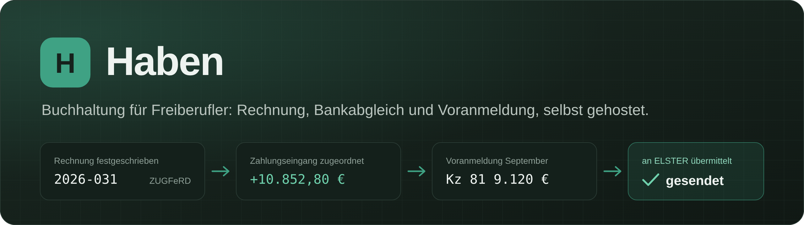
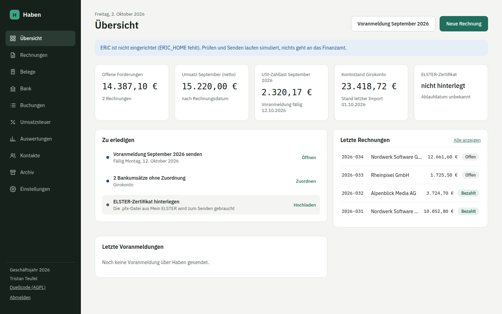
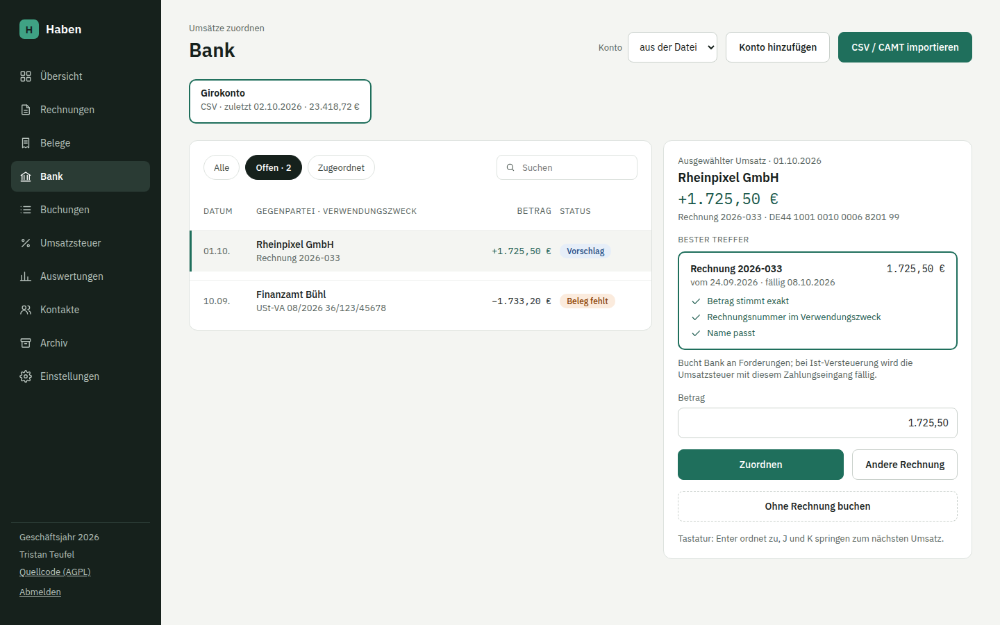
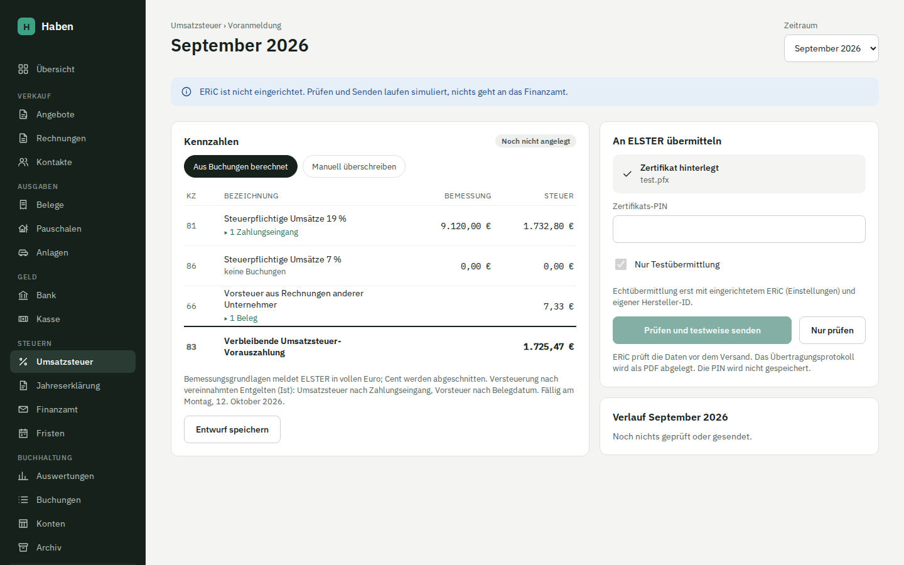
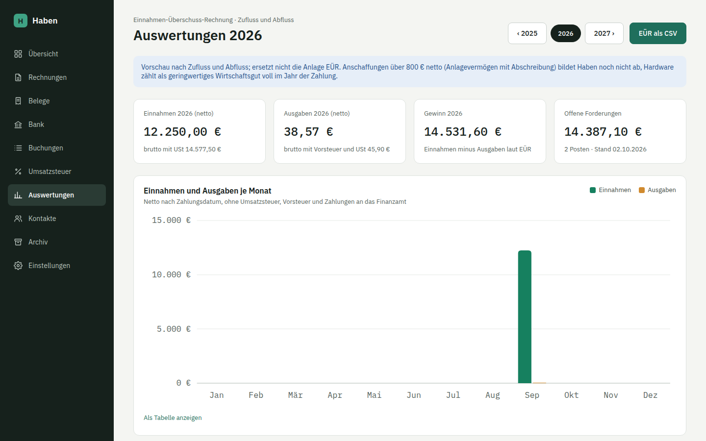

<div align="center">



**Die Buchhaltung für Freiberufler, die du selbst betreibst.**<br>
Rechnungen mit E-Rechnung, Belege, Bankabgleich, EÜR und die monatliche Umsatzsteuer-Voranmeldung direkt an ELSTER.
Auf deinem Server, ohne Abo, ohne Datenabfluss.

[](https://github.com/firsttris/haben/actions/workflows/ci.yml)
[](LICENSE)
[](docs/rechnungen.md)
[](docs/umsatzsteuer.md)
[](https://www.typescriptlang.org/)
[](https://tanstack.com/start)
[](https://www.postgresql.org/)
[](https://hub.docker.com/r/tristanteu/haben)
[](https://hub.docker.com/r/tristanteu/haben)
[](https://hub.docker.com/r/tristanteu/haben/tags)
[](docs/installation.md)

[Warum?](#-warum-haben) •
[Funktionen](#-funktionen) •
[Schnellstart](#-schnellstart) •
[Dokumentation](docs/README.md) •
[Entwicklung](#-entwicklung)



</div>

## 💡 Warum Haben?

Als Freiberufler brauchst du keine Finanzbuchhaltung für den Mittelstand. Du schreibst Rechnungen, sammelst Belege,
gleichst einmal im Monat das Konto ab und schickst die Umsatzsteuer-Voranmeldung. Dafür zahlt man bei Lexware Office,
sevDesk und Co. Jahr für Jahr ein Abo und gibt jede Rechnung und jeden Kontoauszug an einen fremden Dienst.

Haben macht genau diese Arbeit und läuft auf deinem eigenen Server:

- **Ein Weg vom Beleg bis zum Finanzamt**: Rechnung festschreiben, Zahlung im Bankabgleich zuordnen, und die
  Voranmeldung rechnet sich aus den Buchungen. Du prüfst, klickst auf Senden, das Übertragungsprotokoll liegt im Verlauf.
- **Ordnungsgemäß von Anfang an**: Festgeschriebenes ändert die Datenbank selbst nicht mehr (Postgres-Trigger),
  jede Änderung steht mit altem und neuem Wert im Protokoll, Korrekturen laufen über Storno und Gegenbuchung, wie es die GoBD verlangen.
- **Deine Daten bleiben bei dir**: Belege im eigenen Dateisystem, Zertifikat und Schlüssel verschlüsselt in der eigenen Datenbank,
  jedes Jahr als ZIP mit Prüfsummen zum Archivieren. Nur wenn du es einschaltest, liest eine KI Belege aus.
- **Umzug ohne Datenverlust**: Haben holt Rechnungen, Belege und Kontakte aus Lexware Office und archiviert den DATEV-Export,
  damit du kündigen kannst und trotzdem jede Frage des Finanzamts beantworten kannst.

## ✨ Funktionen

- **Rechnungen mit E-Rechnung**: Editor mit Live-Vorschau, lückenloser Nummernkreis, PDF/A-3 mit Typst und
  ZUGFeRD (EN 16931) oder XRechnung 3.0 (CII/UBL), geprüft mit dem KoSIT-Validator. Storno und Rechnungskorrektur, Reverse Charge, Drittland, steuerfreie Umsätze und
  Kleinunternehmer nach § 19 UStG mit Pflichthinweis. Wiederkehrende Rechnungen mit Platzhaltern wie {monat}, als Entwurf oder
  automatisch festgeschrieben. Mahnwesen mit drei Stufen, Verzugszinsen und PDF
- **Belege**: per Drag-and-drop, Kamera oder Teilen-Menü am Handy (PWA). E-Rechnungen werden direkt gelesen,
  andere PDFs und Fotos auf Wunsch von Claude vorausgefüllt. Kategorie pro Lieferant gemerkt
- **Bankabgleich**: Umsätze täglich automatisch über Enable Banking (PSD2) abrufen oder Kontoauszüge von DKB, N26
  oder als CAMT.053 importieren, Dubletten und Lücken erkennen,
  Vorschläge mit Begründung, Zuordnen per Tastatur, Teilzahlungen und Sammelüberweisungen
- **Umsatzsteuer-Voranmeldung**: Kennzahlen aus den Buchungen (Ist- oder Soll-Versteuerung), Herkunft jeder Zahl aufklappbar,
  Vorprüfung vor dem Senden, Übermittlung über ERiC mit Transfer-Ticket und Protokoll-PDF, berichtigte Anmeldungen
- **Buchhaltung im Hintergrund**: doppelte Buchführung nach SKR03 oder SKR04, Journal je Monat, Festschreibung und Audit-Log
- **Anlagen und AfA**: Anlagenverzeichnis mit linearer AfA, GWG und Sammelposten, Anschaffung per Beleg,
  Übernahme mit Restbuchwert aus Lexoffice, AfA-Buchung zum Jahresende
- **Anlagen und AfA**: Anlagenverzeichnis mit linearer AfA, GWG und Sammelposten, Anschaffung per Beleg,
  Übernahme mit Restbuchwert aus Lexoffice, AfA-Buchung zum Jahresende
- **Auswertungen**: Einnahmen-Überschuss-Rechnung nach Zufluss und Abfluss, offene Posten, Monatsverlauf, CSV
- **Jahresexport**: alle Originale, Journal, Bankumsätze, Voranmeldungen und Protokoll als ZIP mit SHA-256-Prüfsummen
- **Umzug aus Lexoffice**: Abruf über die Public API, DATEV-Buchungsstapel, offene Posten übernehmen, Abgleich je Jahr
- **Anmeldung mit Passkey**, Passwort als Ersatz. Ein Konto pro Installation
- **Als App installierbar** auf Handy und Desktop, deutsche Oberfläche, auch am Smartphone bedienbar

## 📸 Screenshots

<table>
  <tr>
    <td width="50%"><br><sub><b>Rechnung schreiben</b>: Vorschau des PDFs, während du tippst</sub></td>
    <td width="50%"><br><sub><b>Bankabgleich</b>: Vorschlag mit Begründung, Enter ordnet zu</sub></td>
  </tr>
  <tr>
    <td width="50%"><br><sub><b>Voranmeldung</b>: aus den Buchungen berechnet, direkt an ELSTER</sub></td>
    <td width="50%"><br><sub><b>Auswertungen</b>: EÜR nach Zufluss und Abfluss</sub></td>
  </tr>
</table>

## 🚀 Schnellstart

Haben läuft als drei Container: die App (`tristanteu/haben`, amd64 und arm64), PostgreSQL und Caddy für HTTPS.
Du brauchst einen Linux-Server mit Docker oder Podman und eine Domain, die auf ihn zeigt (Ports 80 und 443),
denn Passkeys funktionieren nur über HTTPS.

```bash
mkdir haben && cd haben
curl -O https://raw.githubusercontent.com/firsttris/haben/main/deploy/compose.yml
curl -o .env https://raw.githubusercontent.com/firsttris/haben/main/deploy/compose.env.example
# in .env eintragen: DOMAIN, DB_PASSWORD (openssl rand -hex 24),
# AUTH_SECRET und ENCRYPTION_KEY (je openssl rand -base64 32), dann
docker compose up -d
```

Öffne **https://deine-domain**, leg dein Konto an und richte Firmendaten, Nummernkreis und ELSTER ein, wie in
[Erste Schritte](docs/einrichtung.md) beschrieben.

<details>
<summary><b>Podman Quadlet (systemd)</b></summary>

```bash
RAW=https://raw.githubusercontent.com/firsttris/haben/main/deploy
mkdir -p ~/.config/containers/systemd ~/.config/systemd/user ~/.config/haben
for f in haben.network haben-db.volume haben-belege.volume haben-eric-log.volume haben-caddy.volume \
         haben-db.container haben-app.container haben-caddy.container; do
  curl -o ~/.config/containers/systemd/$f "$RAW/quadlet/$f"
done
curl -o ~/.config/systemd/user/haben-backup.service "$RAW/quadlet/haben-backup.service"
curl -o ~/.config/systemd/user/haben-backup.timer "$RAW/quadlet/haben-backup.timer"
curl -o ~/.config/haben/Caddyfile "$RAW/Caddyfile"            # Domain eintragen
curl -o ~/.config/haben/haben.env "$RAW/haben.env.example"    # Domain eintragen
curl -o ~/.config/haben/backup.sh "$RAW/backup.sh" && chmod +x ~/.config/haben/backup.sh
curl -o ~/.config/haben/restore.sh "$RAW/restore.sh" && chmod +x ~/.config/haben/restore.sh

DBPW="$(openssl rand -hex 24)"
printf '%s' "$DBPW" | podman secret create haben-db-password -
printf 'postgres://haben:%s@haben-db:5432/haben' "$DBPW" | podman secret create haben-database-url -
openssl rand -base64 32 | tr -d '\n' | podman secret create haben-auth-secret -
openssl rand -base64 32 | tr -d '\n' | podman secret create haben-encryption-key -

systemctl --user daemon-reload
systemctl --user start haben-db haben-app haben-caddy
```

</details>

ERiC für die ELSTER-Übermittlung, Backup und Wiederherstellung, Updates und alle Umgebungsvariablen stehen in
[Betrieb und Installation](docs/installation.md).

> [!IMPORTANT]
> Sichere den Verschlüsselungsschlüssel (`ENCRYPTION_KEY` bzw. das Secret `haben-encryption-key`) zusätzlich an
> einem zweiten Ort. Ohne ihn sind ELSTER-Zertifikat und Lexoffice-Schlüssel nach einer Wiederherstellung nicht mehr lesbar.

## 📚 Dokumentation

| | |
|---|---|
| [Betrieb und Installation](docs/installation.md) | Podman Quadlets, Caddy, Secrets, Umgebungsvariablen, ERiC, Backup und Wiederherstellung, Updates |
| [Erste Schritte](docs/einrichtung.md) | Konto und Passkey, Firmendaten, Ist oder Soll, SKR03 oder SKR04, Nummernkreis, ELSTER, KI-Auslesung |
| [Rechnungen und E-Rechnung](docs/rechnungen.md) | Editor, Festschreiben, ZUGFeRD und XRechnung, Storno und Korrektur, Kontakte |
| [Belege](docs/belege.md) | Hochladen, E-Rechnungen lesen, KI-Auslesung, Kategorien, Buchen |
| [Bankimport und Abgleich](docs/bank.md) | Automatischer Abruf, Formate, Dubletten, Vorschläge, Zuordnen, Buchungen ohne Beleg |
| [Umsatzsteuer-Voranmeldung](docs/umsatzsteuer.md) | Berechnung aus den Buchungen, Vorprüfung, ELSTER-Übermittlung, Berichtigung |
| [Anlagen und AfA](docs/anlagen.md) | Anlagenverzeichnis, Übernahme aus Lexoffice, AfA zum Jahresende |
| [Auswertungen und Jahresexport](docs/auswertungen.md) | EÜR, offene Posten, Archiv-ZIP, Aufbewahrung |
| [Umzug aus Lexoffice](docs/lexoffice.md) | API-Abruf, DATEV-Import, offene Posten, Abgleich vor der Kündigung |
| [Buchhaltung in Haben](docs/buchhaltung.md) | Buchungssätze, Kontenrahmen, Ist und Soll, GoBD und Festschreibung |
| [Architektur](docs/architektur.md) | Module, Datenmodell, Abläufe, ERiC-Worker, Sicherheit |
| [Entwicklung](docs/entwicklung.md) | Lokale Umgebung, Tests, Migrationen, Konventionen, Mitwirken |

## 🔧 Entwicklung

Voraussetzungen: Node 22, pnpm 10 und PostgreSQL 16.

```sh
pnpm install
cp apps/web/.env.example apps/web/.env   # DATABASE_URL, BETTER_AUTH_SECRET, HABEN_ENCRYPTION_KEY eintragen
pnpm db:migrate
pnpm dev                                  # http://localhost:3000
```

Ohne `ERIC_HOME` simuliert Haben die ELSTER-Übermittlung und zeigt das deutlich an. Ohne `ANTHROPIC_API_KEY` bleibt
die KI-Auslesung aus.

**Stack**: TanStack Start (React, Server Functions), PostgreSQL mit Drizzle, Better Auth mit Passkeys, Zod, Typst für
die Rechnungs-PDFs, `@e-invoice-eu/core` für ZUGFeRD und XRechnung, ERiC über `koffi` in einem eigenen Prozess,
Vitest und Playwright. Aufbau und Abläufe beschreibt die [Architektur](docs/architektur.md), alles Weitere
[Entwicklung](docs/entwicklung.md).

| Paket | Inhalt |
|---|---|
| `apps/web` | Oberfläche, Server Functions, Datenbank, Anmeldung |
| `packages/core` | Beträge, Zeiträume, Voranmeldung, EÜR, Buchungssätze, Zuordnungsvorschläge |
| `packages/einvoice` | Rechnungs-PDF, ZUGFeRD und XRechnung erzeugen, eingehende E-Rechnungen lesen |
| `packages/elster` | ERiC-Anbindung, UStVA-XML, Worker-Prozess |
| `packages/import` | Kontoauszüge (DKB, N26, CAMT.053), DATEV-Buchungsstapel, Lexware-Office-API |

## 🤝 Mitwirken

Fehler und Ideen gern als Issue. Besonders hilfreich sind anonymisierte Kontoauszüge von Banken, die Haben noch nicht
kennt, und Rückmeldungen zur ELSTER-Übermittlung. Vor einem Pull Request bitte `pnpm lint`, `pnpm typecheck` und
`pnpm test` laufen lassen (die Datenbanktests brauchen `TEST_DATABASE_URL`, siehe [Entwicklung](docs/entwicklung.md)).

---

<div align="center">
<sub>Haben ist keine Steuerberatung. Konten, Kategorien und Aufbewahrung vor dem Echtbetrieb mit deiner Steuerberatung abgleichen.<br>
Lizenz: <a href="LICENSE">AGPL-3.0</a>. Wer Haben für andere betreibt, muss ihnen den Quellcode anbieten; der Link steht in der Navigation.<br>
ELSTER ist eine Marke der Finanzverwaltung. Haben steht in keiner Verbindung zu Lexware, DATEV oder der Finanzverwaltung.</sub>
</div>
