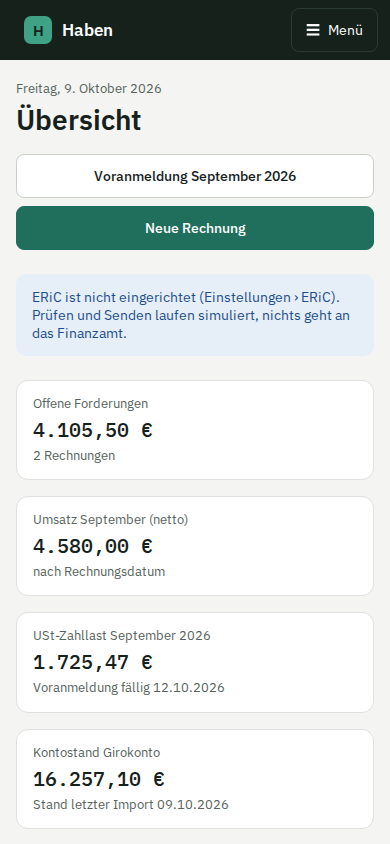

# Dokumentation

Hier steht alles über Haben im Detail: wie du es betreibst und einrichtest, was jede Seite macht, was im Hintergrund
gebucht wird und wie der Code aufgebaut ist. Den schnellen Überblick gibt die [README](../README.md).

## Betrieb

| | |
|---|---|
| [Betrieb und Installation](installation.md) | Podman Quadlets, Caddy, Secrets, Umgebungsvariablen, ERiC einbinden, Backup und Wiederherstellung, Updates, häufige Probleme |
| [Erste Schritte](einrichtung.md) | Konto und Passkey, Firmendaten, Ist oder Soll, SKR03 oder SKR04, Nummernkreis, ELSTER-Zertifikat, KI-Auslesung, Bankkonten |

## Im Alltag

| | |
|---|---|
| [Rechnungen und E-Rechnung](rechnungen.md) | Editor, Festschreiben, ZUGFeRD und XRechnung, Pflichtangaben, Storno und Korrektur, Kontakte |
| [Angebote](angebote.md) | Eigener Nummernkreis, PDF, Versand per E-Mail, Antwort des Kunden, Rechnung aus dem Angebot |
| [Belege](belege.md) | Hochladen, Teilen am Handy, E-Rechnungen lesen, KI-Auslesung, Kategorien, Buchen |
| [Pauschalen](pauschalen.md) | Homeoffice-Tagespauschale, Fahrten mit dem Privatfahrzeug, Verpflegungsmehraufwand; Buchung und Storno |
| [Anlagen und AfA](anlagen.md) | Anlagenverzeichnis, Anschaffung per Beleg, Übernahme aus Lexoffice, AfA buchen, Abgang |
| [Bankimport und Abgleich](bank.md) | DKB, N26, CAMT.053, Dubletten, Saldenprüfung, Vorschläge, Teilzahlungen, Buchungen ohne Beleg |
| [Umsatzsteuer-Voranmeldung](umsatzsteuer.md) | Kennzahlen aus den Buchungen, Vorprüfung, Prüfen, Test- und Echtübermittlung, Berichtigung |
| [Finanzamt](finanzamt.md) | Nachrichten über ELSTER, Antrag auf Herabsetzung der Vorauszahlungen |
| [Fristen](fristen.md) | Voranmeldungen, Abgabefristen, Vorauszahlungen, Einspruchsfristen; Kalender-Abo und Erinnerungen per E-Mail |
| [Jahreserklärungen](jahreserklaerung.md) | Umsatzsteuererklärung und Anlage EÜR mit AVEÜR aus den Buchungen, Prüfen, Test- und Echtübermittlung |
| [Auswertungen und Jahresexport](auswertungen.md) | EÜR, offene Posten, Monatsverlauf, CSV, Archiv-ZIP mit Prüfsummen, Aufbewahrung |
| [Umzug aus Lexoffice](lexoffice.md) | API-Abruf, DATEV-Buchungsstapel, Originalexporte, offene Posten, Abgleich vor der Kündigung |

## Hintergrund

| | |
|---|---|
| [Buchhaltung in Haben](buchhaltung.md) | Grundsätze, GoBD und Festschreibung, Ist und Soll, Kontenrahmen, alle Buchungssätze, Steuerschlüssel |
| [Architektur](architektur.md) | Module, Datenmodell, Ablauf von Anfragen, Dateiablage, ERiC-Worker, E-Rechnung, Sicherheit |
| [Entwicklung](entwicklung.md) | Lokale Umgebung, Befehle, Tests, Migrationen, Konventionen, neue Bankformate, Mitwirken |

## Screenshots

