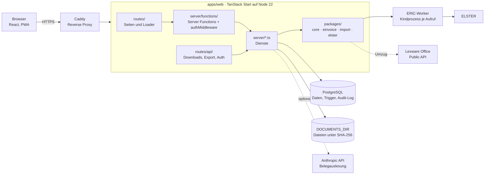

# Architektur

Haben ist eine einzelne Node-Anwendung auf Basis von TanStack Start mit PostgreSQL als einziger Datenbank und einem Verzeichnis für Belegdateien. Diese Seite beschreibt Aufbau, Datenmodell, Abläufe und die wichtigsten Entwurfsentscheidungen. Für die Entwicklungsumgebung siehe [Entwicklung](entwicklung.md), für den Betrieb [Installation](installation.md).

## Überblick

Der Browser spricht nur mit der eigenen Anwendung. Seiten laden ihre Daten über Server Functions; Dateien (Rechnungs-PDFs, Belege, Protokolle, CSV, ZIP) kommen über eigene API-Routen. Nach außen verbindet sich der Server nur mit ELSTER (über ERiC), optional mit der Anthropic-API und während des Umzugs mit Lexware Office.

## Module

### Pakete

| Paket | Aufgabe |
| --- | --- |
| `packages/core` | Reine Fachlogik ohne Ein- und Ausgabe: Cent-Beträge und Formatierung, Zeiträume und Fälligkeiten mit Feiertagen je Bundesland (`holidays.ts`), Steuernummer-Umrechnung ins ELSTER-Format, Rechnungssummen, umsatzsteuerliche Behandlung von Rechnungen (`treatment.ts`), Kontenrahmen und Buchungssätze (`posting.ts`), Vorschläge für den Bankabgleich (`matching.ts`), UStVA-Berechnung, EÜR (`euer.ts`), Umsatzsteuer aus Lexoffice-Belegen (`legacy-vat.ts`) |
| `packages/einvoice` | Rechnungs-PDF mit Typst (Vorlage `templates/rechnung.typ`), ZUGFeRD und XRechnung über `@e-invoice-eu/core`, Prüfung der Pflichtfelder je Format, Lesen eingehender E-Rechnungen (eingebettetes XML aus PDFs, CII und UBL) |
| `packages/import` | Parser für Kontoauszüge (DKB, N26, CAMT.053), Dekodierung, Deduplizierung, Saldenprüfung, DATEV-Buchungsstapel (`datev.ts`), Client und Abbildungen für die Lexware-Office-API (`lexoffice/`), Client und Abbildung für den Kontoabruf über Enable Banking (`enablebanking/`) |
| `packages/elster` | `ElsterClient` mit echtem ERiC-Client (Kindprozess, `koffi`) und simuliertem Client, UStVA-XML, XML der Jahreserklärungen (Umsatzsteuererklärung E50, Anlage EÜR mit AVEÜR E77, `erklaerung.ts`), Sonstige Nachricht (`nachricht.ts`), Änderung der Bankverbindung (`bankverbindung.ts`), Datenabholung aus dem Postfach (`postfach.ts`, Download der Anhänge über Otto), Transfer-Ticket, ERiC-Download (`install.ts`) |

### apps/web

| Ordner | Aufgabe |
| --- | --- |
| `src/routes/` | Dateibasiertes Routing. `_app/` enthält alle Seiten hinter der Anmeldung (Übersicht, Rechnungen, Belege, Bank, Umsatzsteuer, Auswertungen, Buchungen, Kontakte, Archiv, Einstellungen); `setup.tsx` und `login.tsx` sind öffentlich |
| `src/routes/api/` | HTTP-Routen für Better Auth (`auth/$`), Dateien (`rechnung`, `beleg`, `altbeleg`, `archiv`, `protokoll`), Teilen-Ziel der PWA (`belege/teilen`), EÜR als CSV (`auswertungen/$jahr`) und Jahresarchiv (`export/$jahr`) |
| `src/components/` | React-Komponenten, die mehrere Seiten nutzen (Rechnungseditor, Vorschau, Upload, Statusanzeigen), dazu `archiv/` für die Umzugsseite |
| `src/server/functions/` | Server Functions je Bereich: Eingaben mit Zod prüfen, `authMiddleware` anhängen, Dienst aufrufen. Keine Fachlogik |
| `src/server/*.ts` | Dienste: `invoices`, `documents`, `extraction`, `bank`, `bank-sync` (Kontoabruf), `annual` (Jahreserklärungen), `finanzamt` (Nachrichten, Bankverbindung), `postfach` (Bescheide abholen), `taxpayer` (persönliche Angaben), `vat`, `vat-figures`, `reports`, `export`, `lexoffice`, `legacy-open`, `archive`, `contacts`, `company`, `settings-guard` (Sperren für Kontenrahmen, Versteuerung und Kleinunternehmer); dazu `auth`, `crypto`, `storage`, `file-response`, `env` |
| `src/server/db/` | Drizzle-Schema (`schema.ts`, `auth-schema.ts`), Verbindung, `withActor` für das Audit-Log, Migrationsskript |
| `apps/web/drizzle/` | SQL-Migrationen; Trigger und Funktionen stehen in eigenen Dateien (`0001_festschreibung.sql`, `*_trigger.sql`) |
| `src/styles/`, `styles.css` | Globales Stylesheet und seitenbezogene Stylesheets (Auswertungen, Archiv) |
| `src/lib/` | Formatierung und Better-Auth-Client für den Browser |

## Datenmodell

Alle Tabellen stehen in `apps/web/src/server/db/schema.ts`. Beträge sind ganze Cent, Steuersätze Basispunkte. Die Spalte „Schutz“ fasst die Trigger aus `apps/web/drizzle/` zusammen; Einzelheiten in [Buchhaltung in Haben](buchhaltung.md#gobd-unveränderbarkeit-in-der-datenbank).

### Stammdaten

| Tabelle | Zweck | Schutz |
| --- | --- | --- |
| `company` | Firmendaten, Versteuerungsart, Kontenrahmen, Zahlungsziel, Rechnungsformat; genau eine Zeile | Audit |
| `elster_certificates` | ELSTER-Zertifikatsdatei, verschlüsselt | Audit ohne Chiffrat |
| `contacts` | Kunden und Lieferanten, mit Herkunft aus Lexoffice | nicht löschbar, versioniert, Audit |
| `contact_versions` | Stand eines Kontakts je Version | nur anhängen |
| `bank_accounts` | Bankkonten, über die IBAN zugeordnet | Audit |

### Rechnungen und Belege

| Tabelle | Zweck | Schutz |
| --- | --- | --- |
| `invoices` | Ausgangsrechnungen, Stornos und Korrekturen mit PDF, XML, SHA-256 und umsatzsteuerlicher Behandlung (`tax_treatment`, `exemption_reason`); aus Vorlagen mit `recurring_id` und Termin (`recurring_date`, eindeutig je Vorlage) | gesperrt ab Festschreibung, Audit ohne PDF/XML |
| `recurring_invoices` | Vorlagen für wiederkehrende Rechnungen: Positionen, Intervall, nächster Termin, Modus (Entwurf oder festschreiben) | Audit |
| `dunnings` | Zahlungserinnerungen und Mahnungen mit Stufe, Frist, Gebühr, Pauschale, Zinsen und PDF | nur anhängen, Audit ohne PDF |
| `invoice_lines` | Positionen einer Rechnung | gesperrt mit der Rechnung |
| `invoice_number_counters` | Letzte vergebene Nummer je Jahr | darf nicht sinken, Audit |
| `documents` | Eingangsbelege; Datei im Dateisystem, Felder aus Auslesung oder Hand, beim Buchen festgehalten, ob mit Vorsteuerabzug (`vorsteuer_abzug`) | gesperrt ab Buchung, Audit |
| `document_amounts` | Beträge eines Belegs je Steuersatz | gesperrt mit dem Beleg |

### Buchhaltung, Bank und Umsatzsteuer

| Tabelle | Zweck | Schutz |
| --- | --- | --- |
| `journal_entries` | Buchungen mit Herkunft (Rechnung, Beleg, Zuordnung) und Verweis auf die stornierte Buchung | gesperrt ab Entstehung, Soll = Haben beim Sperren, Audit |
| `journal_lines` | Buchungszeilen mit Konto, Soll, Haben, Steuerschlüssel | gesperrt mit der Buchung |
| `bank_imports` | Jede importierte Auszugsdatei mit SHA-256, Zeitraum, Salden | nur anhängen, Audit |
| `bank_transactions` | Importierte Umsätze mit Hash zur Deduplizierung | nur anhängen |
| `bank_connections` | Zustimmungen für den Kontoabruf über Enable Banking: Bank, Status, Ablauf, freigegebene Konten mit Abrufstand; Sitzungskennung verschlüsselt | Audit ohne Chiffrat |
| `allocations` | Zuordnung eines Umsatzes (ganz oder teilweise); aufgehoben per Gegenzeile | nur anhängen, Betragsprüfung, Audit |
| `vat_returns` | Voranmeldungen je Monat mit Kennzahlen, berechnet oder überschrieben | gesperrt nach Echtübermittlung, Audit |
| `vat_return_submissions` | Jede Prüfung und Übermittlung mit XML und Protokoll-PDF | nur anhängen, Audit ohne PDF |
| `elster_messages` | Nachrichten an das Finanzamt (Sonstige Nachricht, Änderung der Bankverbindung) mit Text, Werten und XML | nur anhängen, Audit |
| `postfach_requests` | Abrufe des ELSTER-Postfachs und Bestätigungen der Abholung mit XML | nur anhängen, Audit |
| `postfach_documents` | Abgeholte Bescheide und Mitteilungen, Datei im Dokumentenspeicher | nur anhängen, Audit |
| `annual_submissions` | Prüfungen und Übermittlungen der Jahreserklärungen mit Werten, XML und Protokoll-PDF; höchstens eine erfolgreiche Echtübermittlung je Erklärung und Jahr | nur anhängen, Audit ohne PDF |
| `assets` | Anlagenverzeichnis: Art, Abschreibung, Anlagekonto, Anschaffung, Nutzungsdauer, Übernahme, Abgang | Grundlagen fest nach der ersten Buchung, Audit |
| `asset_depreciations` | Gebuchte AfA je Anlage und Jahr mit Verweis auf die Buchung | nur anhängen, Audit |

### Archiv und Umzug

| Tabelle | Zweck | Schutz |
| --- | --- | --- |
| `archive_files` | Originalexporte (DATEV, IDEA, ELSTER-Protokolle, Kontoauszüge) unter SHA-256 | nur anhängen, Audit |
| `datev_bookings` | Zeilen eines DATEV-Buchungsstapels, unverändert | nur anhängen |
| `lexoffice_connection` | API-Schlüssel für Lexware Office, verschlüsselt; eine Zeile | Audit ohne Chiffrat |
| `lexoffice_imports` | Abrufe mit fortlaufend geschriebenem Fortschritt | Audit beim Anlegen |
| `lexoffice_vouchers` | Rechnungen und Belege aus Lexoffice mit vollständiger API-Antwort | nur anhängen |
| `lexoffice_voucher_files` | Dateien zu einem Lexoffice-Beleg | nur anhängen |

### Protokoll und Anmeldung

| Tabelle | Zweck | Schutz |
| --- | --- | --- |
| `audit_log` | Jede Änderung mit Zeitpunkt, Nutzer, Tabelle, altem und neuem Wert | nur anhängen, auch kein `TRUNCATE` |
| `user`, `session`, `account`, `verification`, `passkey` | Tabellen von Better Auth samt Passkey-Plugin | – |

## Anmeldung

Haben hat genau einen Nutzer. Die Ersteinrichtung (`/setup`) legt ihn mit E-Mail und Passwort an (mindestens 12 Zeichen); ein Hook in Better Auth lehnt jedes weitere Konto ab. Danach meldet man sich per Passkey an, das Passwort bleibt Rückfallebene. Better Auth begrenzt Anmeldeversuche (20 je Minute) und liest die Client-Adresse hinter Caddy aus `X-Forwarded-For`.

Geschützt wird an drei Stellen:

- Die Layout-Route `_app` leitet ohne Sitzung auf `/login` bzw. vor der Einrichtung auf `/setup` um.
- Jede Server Function mit Daten hängt `authMiddleware` an (`apps/web/src/server/middleware.ts`), die die Sitzung prüft und den Nutzer in den Kontext legt. Die Umleitung im Browser allein schützt also nichts.
- Jede API-Route prüft die Sitzung selbst und antwortet sonst mit 401.

## Ablauf einer Anfrage

### Rechnung festschreiben

1. Die Seite ruft die Server Function `finalizeInvoiceDraft` auf. `authMiddleware` prüft die Sitzung.
2. `finalizeInvoice` in `server/invoices.ts` prüft vorab Firmendaten, Kunde, Positionen, Beträge, die umsatzsteuerliche Behandlung und die Pflichtfelder des gewählten E-Rechnungsformats.
3. In einer Transaktion mit `withActor`:
   - Entwurf mit `SELECT … FOR UPDATE` sperren,
   - Zähler des Jahres per Upsert um eins erhöhen und Nummer bilden (`2026-034`),
   - PDF und XML erzeugen (siehe unten),
   - Rechnung auf `final` setzen, mit Verkäufer- und Käuferdaten, Summen, PDF, XML, SHA-256 und `locked_at`,
   - Buchung und Zeilen anlegen und festschreiben; der Trigger prüft Soll = Haben.
4. Schlägt ein Schritt fehl, wird alles zurückgerollt. Die Nummer ist dann nicht verbraucht; der Nummernkreis bleibt lückenlos.

### Bankumsatz zuordnen

1. `allocateTransaction` → `allocate` in `server/bank.ts`, in einer Transaktion mit `withActor`.
2. Der Umsatz wird mit `FOR UPDATE` gesperrt; Vorzeichen und offener Betrag werden geprüft, ebenso der offene Betrag der Rechnung bzw. des Belegs.
3. Haben bildet den Buchungssatz mit `@haben/core` (`invoicePaymentPosting`, `documentPaymentPosting` oder `directPosting`), legt die Zuordnung an und bucht auf den Buchungstag des Umsatzes.
4. Der Trigger auf `allocations` prüft noch einmal, dass die Summe der Zuordnungen den Umsatz nicht übersteigt. Bei einem Zahlungseingang merkt sich Haben die IBAN des Kunden, falls noch keine hinterlegt ist.

Aufheben legt eine Gegenzeile und eine Gegenbuchung an, statt etwas zu löschen.

## Dateiablage

Belegdateien, Lexoffice-Dateien und Archivexporte liegen im Dateisystem unter `DOCUMENTS_DIR` (Standard `data/belege`, im Container ein Volume), adressiert über ihren SHA-256: `<DOCUMENTS_DIR>/ab/abcdef…`. Daraus folgt:

- Dieselbe Datei wird nur einmal abgelegt; ein zweites Hochladen findet den vorhandenen Beleg.
- Geschrieben wird atomar über eine temporäre Datei und `rename`, mit Dateirechten 0640.
- Beim Lesen prüft Haben den Hash. Eine veränderte Datei fällt sofort auf („beschädigt“).
- Den Dateityp erkennt Haben am Inhalt (PDF, JPEG, PNG, WebP, HEIC, XML), nicht an Endung oder Browserangabe.

Rechnungs-PDFs und -XML sowie ERiC-Protokolle liegen dagegen direkt in der Datenbank (`bytea` bzw. `text`). Datenbank und Belegverzeichnis gehören beide ins Backup (`deploy/backup.sh`).

## ERiC-Worker

ERiC, die native Bibliothek der Finanzverwaltung, läuft nie im Anwendungsprozess. `EricProcessClient` in `packages/elster` startet für jeden Aufruf einen kurzlebigen Kindprozess (`worker.ts`), der ERiC per `koffi` lädt, genau eine Anfrage über IPC ausführt und sich beendet. Stürzt ERiC ab oder hängt, bekommt die Anwendung nur eine Fehlermeldung; nach 120 Sekunden wird der Kindprozess beendet. Beim Postfachabruf sendet derselbe Kindprozess die PostfachAnfrage und lädt danach die Anhänge über Otto (`libotto.so` aus dem ERiC-Paket); die Dateien reisen base64-kodiert über IPC zurück, bestätigt wird erst, wenn die Anwendung sie gespeichert hat.

Für eine Übermittlung entschlüsselt Haben das Zertifikat und schreibt es in ein temporäres Verzeichnis (Rechte 0700, Datei 0600), das nach dem Aufruf gelöscht wird. Die PIN wird je Übermittlung abgefragt und nie gespeichert. Vor dem Senden prüft der Client, dass der Testmerker im XML zur gewünschten Art passt (Test- oder Echtübermittlung). Ohne ERiC verwendet Haben einen simulierten Client und zeigt das in der Oberfläche an.

ERiC selbst liefert Haben nicht mit. `packages/elster/src/install.ts` lädt das Paket auf Wunsch von `download.elster.de` (Einstellungen, `ERIC_AUTO_INSTALL` im Entrypoint oder `install-cli.ts`), entpackt per Stream nur die Einträge unter `Linux-x86_64/` in einen Unterordner von `ERIC_DIR` und schaltet über die Datei `AKTUELL` um, wenn Bibliothek und Plugins vollständig sind; so lässt sich auch ein Volume als Ziel nutzen. `ERIC_HOME` hat Vorrang. Der ELSTER-Client wird neu erzeugt, sobald sich das ERiC-Verzeichnis ändert.

## E-Rechnung

Beim Festschreiben entsteht die Rechnung in zwei Stufen:

1. **Sichtbares PDF:** Typst setzt die Vorlage `rechnung.typ` mit IBM Plex Sans als PDF/A-3b. Der Compiler läuft im Prozess (`@myriaddreamin/typst-ts-node-compiler`).
2. **E-Rechnung:** `@e-invoice-eu/core` erzeugt aus denselben Daten
   - bei **ZUGFeRD** (Profil EN 16931) ein PDF/A-3 mit eingebettetem `factur-x.xml`; Haben liest das XML danach wieder aus und speichert es zusätzlich,
   - bei **XRechnung** (CII oder UBL) das XML; das Typst-PDF bleibt als Sichtfassung dabei.

Eingehende E-Rechnungen liest `packages/einvoice` direkt: das eingebettete XML aus ZUGFeRD-PDFs oder reines XML (CII, UBL). Die Felder des Belegs werden daraus vorbefüllt, ohne KI.

## Hintergrundarbeit

Haben hat keine Job-Queue. Länger laufende Arbeit läuft als Promise im Serverprozess weiter, nachdem die Anfrage beantwortet ist:

- **KI-Auslesung von Belegen:** Nach dem Hochladen eines PDFs oder Fotos ohne E-Rechnung setzt Haben den Status „läuft“ und schickt die Datei an die Anthropic-API, wenn `ANTHROPIC_API_KEY` gesetzt ist. Die Antwort folgt einem festen Zod-Schema; Beträge kommen als Dezimaltext, damit nichts gerundet wird. Ohne Schlüssel verlässt keine Datei den Server.
- **Wiederkehrende Rechnungen:** Ein Nitro-Plugin (`server/plugins/scheduler.ts`) startet beim Serverstart einen Timer: 30 Sekunden nach dem Start und danach stündlich legt `runDueRecurring` die fälligen Rechnungen an (`server/recurring.ts`). Verpasste Termine holt der Lauf mit ihrem Datum nach; ein eindeutiger Index auf `(recurring_id, recurring_date)` verhindert Doppelte. Im Audit-Log steht als Akteur `system:wiederkehrend`. `HABEN_SCHEDULER=off` schaltet den Timer ab.
- **Kontoabruf:** Derselbe Timer ruft `runDueBankSyncs` auf (`server/bank-sync.ts`). Jede aktive Verbindung wird höchstens alle 20 Stunden abgerufen, auch nach einem Fehler, weil PSD2 Banken nur wenige Zugriffe ohne den Nutzer am Tag erlaubt. Der Abruf baut aus der API-Antwort einen `ParsedStatement` und speichert ihn über denselben Weg wie eine Datei (`storeStatement`), also mit Hash-Dubletten und Kontosperre. Akteur im Audit-Log ist `system:bankabruf`.
- **Lexoffice-Abruf:** läuft mit einem `AbortController` im Prozess und schreibt seinen Fortschritt höchstens einmal je Sekunde in `lexoffice_imports`. Nach einem Neustart erkennt Haben einen hängengebliebenen Lauf an drei Minuten ohne Fortschritt; ein neuer Lauf setzt fort, weil vorhandene Belege übersprungen werden.

Laufende Auslesungen merkt sich der Prozess. Steht ein Beleg auf „läuft“, ohne dass der Prozess ihn ausliest (Neustart während der Auslesung), setzt Haben ihn beim nächsten Öffnen auf „Fehler“, damit er wieder bearbeitet werden kann.

## Sicherheit

- **Verschlüsselung:** ELSTER-Zertifikat, Lexware-API-Schlüssel und die Sitzungskennung des Kontoabrufs liegen mit AES-256-GCM verschlüsselt in der Datenbank (`server/crypto.ts`, Format IV | Tag | Chiffrat). Der Schlüssel `HABEN_ENCRYPTION_KEY` (32 Byte, base64) steht nur in der Umgebung.
- **Dateiauslieferung:** Gespeicherte Dateien gehen mit `X-Content-Type-Options: nosniff`, `Cache-Control: private, no-store` und einer Content-Security-Policy hinaus: für PDFs `default-src 'none'; object-src 'self'`, sonst `sandbox`. Nur PDFs und Bilder werden im Browser angezeigt; XML und JSON kommen als Text, alles andere als Download.
- **Kein Geheimnis im Export:** Das Jahresarchiv enthält weder Zertifikat noch API-Schlüssel. Das Audit-Log speichert Chiffrate gar nicht erst, der Export filtert sie zusätzlich heraus.
- **Kontoabruf:** Die Rückleitung der Bank (`/api/bank/callback`) verlangt eine angemeldete Sitzung und einen `state`, den Haben beim Start zufällig erzeugt und nur einmal annimmt. Der Zugriff ist lesend; Zahlungen kann Haben nicht auslösen. Der private Schlüssel der Enable-Banking-Anwendung liegt nur in der Umgebung bzw. als Datei, nie in der Datenbank.
- **Proxy:** Caddy terminiert TLS und setzt HSTS, `X-Frame-Options: DENY` und `Referrer-Policy: same-origin`.

> [!IMPORTANT]
> `HABEN_ENCRYPTION_KEY` muss getrennt vom Datenbank-Backup gesichert werden. Ohne ihn lassen sich Zertifikat und API-Schlüssel nach einer Wiederherstellung nicht mehr entschlüsseln; das Zertifikat müsste neu hochgeladen werden.

## Entwurfsentscheidungen

| Entscheidung | Warum |
| --- | --- |
| Ganze Cent statt Dezimalzahlen | Keine Rundungsfehler durch Gleitkomma; Summen stimmen auf den Cent mit Rechnung und ELSTER überein |
| Unveränderbarkeit per Postgres-Trigger | GoBD verlangt, dass festgeschriebene Daten nicht geändert werden. Trigger greifen auch bei Fehlern im Code und bei direktem Datenbankzugriff |
| Korrektur nur durch neue Zeilen | Storno, Gegenbuchung, Gegenzeile und berichtigte Voranmeldung lassen den ursprünglichen Stand sichtbar, statt ihn zu überschreiben |
| Audit-Log per Trigger mit Nutzer aus der Transaktion | Lückenlos, ohne dass jede Funktion selbst protokollieren muss |
| Ein Nutzer, Passkey | Haben ist für eine Person gedacht. Kein Rollenmodell, weniger Angriffsfläche |
| Server Functions statt eigener REST-API | Typsichere Aufrufe von der Seite bis zur Datenbank in einem Projekt; HTTP-Routen nur für Dateien |
| Fachlogik in `packages/core` ohne Ein- und Ausgabe | Buchungssätze, EÜR und Steuerberechnung sind ohne Datenbank testbar |
| Dateien unter SHA-256 | Keine Dubletten, Integrität bei jedem Lesen prüfbar, Hash im Export als Nachweis |
| ERiC im Kindprozess | Eine abstürzende native Bibliothek reißt die Anwendung nicht mit |
| Jahresexport als Stream | Ein Jahr mit vielen Belegen braucht kaum Arbeitsspeicher; die Prüfsummen entstehen beim Packen |
| Keine Job-Queue | Ein Prozess, eine Datenbank, einfacher Betrieb. Die einzigen langen Aufgaben sind wiederholbar bzw. fortsetzbar |
| KI-Auslesung optional | Ohne Schlüssel bleiben alle Daten auf dem eigenen Server; E-Rechnungen werden ohnehin direkt gelesen |
| Altbestand aus Lexoffice getrennt | Archivierte Daten bleiben unverändert und beeinflussen weder Voranmeldung noch Auswertungen; nur ausdrücklich übernommene offene Posten werden Teil der Buchhaltung |
