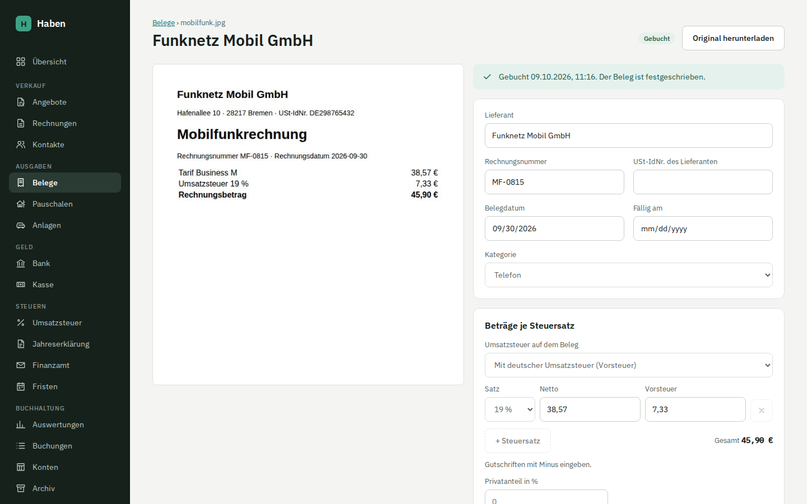

# Belege und Eingangsrechnungen

Unter **Belege** legst du Eingangsrechnungen und Quittungen ab. E-Rechnungen liest Haben direkt aus, andere PDFs und Fotos auf Wunsch mit Claude. Du prüfst die Felder, wählst eine Kategorie und buchst den Beleg; danach ist er festgeschrieben.

## So gehst du vor

1. Beleg hochladen (siehe unten).
2. Den Beleg in der Liste öffnen. Ist er aus einer E-Rechnung oder von der KI vorbefüllt, steht dort „Vorbefüllt aus … Bitte prüfen und bestätigen.“
3. **Lieferant**, **Rechnungsnummer**, **USt-IdNr. des Lieferanten**, **Belegdatum**, **Fällig am** und **Kategorie** prüfen oder eintragen.
4. Unter **Beträge je Steuersatz** Netto und Vorsteuer je Satz prüfen. Mit **+ Steuersatz** kommt eine Zeile für einen weiteren Satz dazu (höchstens 19 %, 7 % und 0 % je einmal).
5. Unter **Bezahlung** wählen, ob der Beleg über das Geschäftskonto oder privat bezahlt wurde.
6. **Bestätigen und buchen**, dann **Jetzt buchen**. Ungespeicherte Änderungen werden dabei vorher gespeichert.

Mit **Speichern** sicherst du Zwischenstände, ohne zu buchen.

## Hochladen

Es gibt drei Wege, alle führen zum selben Ergebnis:

| Weg | Wie |
| --- | --- |
| Ziehen und Ablegen | Dateien auf die Fläche „Belege hierher ziehen“ ziehen. |
| Dateiauswahl | **Dateien auswählen**, auch mehrere auf einmal (bis 50 je Vorgang). |
| Kamera | Auf dem Handy **Foto aufnehmen**; öffnet direkt die Rückkamera. |
| Teilen-Menü | In der als App installierten Version (PWA) taucht Haben im Teilen-Menü des Telefons auf. Geteilte Dateien gehen an `/api/belege/teilen` (bis 20 je Vorgang). Bei genau einer Datei öffnet Haben danach gleich den Beleg, sonst die Liste. |

Erlaubt sind PDF, JPEG, PNG, WebP, HEIC und E-Rechnungs-XML bis 20 MB je Datei. Nach dem Hochladen meldet Haben je Datei „abgelegt“, „liegt schon in Haben, nicht doppelt abgelegt“ oder den Grund der Ablehnung.

### Was im Hintergrund passiert

1. **Dateityp erkennen.** Haben erkennt den Typ am Inhalt der Datei (den ersten Bytes), nicht an Dateiendung oder Browserangabe. XML wird auch mit vorangestelltem UTF-8-BOM erkannt.
2. **Ablegen unter dem SHA-256.** Die Datei wird unter ihrem SHA-256-Hash im Verzeichnis `DOCUMENTS_DIR` gespeichert (`<dir>/ab/abcdef…`), atomar über eine temporäre Datei. Beim Lesen prüft Haben den Hash erneut und meldet eine beschädigte Datei.
3. **Keine Dubletten.** Gibt es schon einen Beleg mit demselben Hash, entsteht kein zweiter; du landest beim vorhandenen.
4. **E-Rechnung lesen.** Bei PDF und XML versucht Haben zuerst, eine E-Rechnung zu lesen (siehe unten).
5. **KI-Auslesung.** Ist es keine E-Rechnung und ist ein Anthropic-API-Schlüssel eingerichtet, startet für PDF, JPEG, PNG und WebP die KI-Auslesung im Hintergrund. Der Beleg zeigt solange „Wird ausgelesen“, Liste und Detailseite aktualisieren sich selbst.

Ohne E-Rechnung und ohne KI füllst du die Felder von Hand aus.

## E-Rechnungen

Haben liest diese Formate:

| Format | Erkennung | Quelle in der Liste |
| --- | --- | --- |
| ZUGFeRD 2.x / Factur-X | PDF mit eingebetteter XML-Datei | ZUGFeRD |
| ZUGFeRD 1.0 | PDF mit eingebetteter XML (`CrossIndustryDocument`) | ZUGFeRD |
| XRechnung als PDF-Anhang | PDF mit eingebetteter `xrechnung.xml` | ZUGFeRD |
| XRechnung CII | XML-Datei mit Wurzel `CrossIndustryInvoice` | XRechnung |
| XRechnung UBL | XML-Datei mit Wurzel `Invoice` oder `CreditNote` | XRechnung |

Im PDF sucht Haben zuerst nach den Anhängen `factur-x.xml`, `zugferd-invoice.xml` und `xrechnung.xml`, danach nach jedem anderen XML-Anhang.

Übernommen werden Lieferant, USt-IdNr. des Lieferanten, Rechnungsnummer, Rechnungsdatum, Fälligkeit, Währung und die Beträge je Steuersatz. Gutschriften (z. B. Typcode 381 oder UBL `CreditNote`) werden mit negativen Beträgen übernommen. Steuersätze außer 19, 7 und 0 % und Fremdwährungen werden nicht übernommen, sondern als Hinweis am Beleg angezeigt.

Lässt sich eine hochgeladene XML-Datei nicht als E-Rechnung lesen, steht der Fehler am Beleg. Bei einem PDF, dessen eingebettetes XML nicht lesbar ist, geht Haben weiter zur KI-Auslesung.

Eine E-Rechnung bringt keine Kategorie mit. Haben schlägt die Kategorie des letzten gebuchten Belegs desselben Lieferanten vor; gibt es keinen, bleibt das Feld leer.

## KI-Auslesung mit Claude

Die KI-Auslesung ist optional und nur aktiv, wenn `ANTHROPIC_API_KEY` gesetzt ist (siehe [installation.md](installation.md)). Ohne Schlüssel funktioniert alles andere weiter, auch das Lesen von E-Rechnungen.

**Was gesendet wird:** die Belegdatei selbst (PDF als Dokument, JPEG, PNG oder WebP als Bild) zusammen mit einer festen Anweisung und der Liste der Ausgabenkategorien. Sonst nichts aus deiner Buchhaltung. HEIC-Fotos und XML-Dateien gehen nicht an die KI.

**Was zurückkommt:** ein festes Schema mit Lieferant, USt-IdNr., Rechnungsnummer, Belegdatum, Fälligkeit, Währung, Netto und Steuer je Steuersatz, Bruttobetrag, Kategorie, ob es eine Gutschrift ist, und einem Hinweis bei Unklarheiten. Die Anweisung verlangt, nur zu übernehmen, was auf dem Beleg steht, und nichts zu raten.

Haben prüft die Antwort und zeigt Auffälligkeiten als Hinweis am Beleg:

- Netto plus Steuer weicht vom Gesamtbetrag ab.
- Ein Betrag ist nicht lesbar.
- Die Währung ist nicht Euro.
- Der Hinweis der KI zu unklaren Stellen.

Die KI bucht nie selbst. Jeder ausgelesene Beleg bleibt im Status „Zu prüfen“, bis du ihn mit **Bestätigen und buchen** bestätigst. Mit **Mit KI neu auslesen** kannst du die Auslesung wiederholen, solange der Beleg nicht gebucht ist; dabei werden die Felder überschrieben. Fehler (ungültiger Schlüssel, Auslastung, keine Verbindung, abgelehnte Auslesung) stehen am Beleg, der dann den Status „Prüfen“ trägt.

Bei der Kategorie hat der letzte gebuchte Beleg desselben Lieferanten Vorrang vor dem Vorschlag der KI. Erkannt wird der Lieferant an der USt-IdNr. oder am Namen (ohne Groß- und Kleinschreibung).

## Kategorien

Die Kategorie bestimmt das Aufwandskonto. Die Zuordnung steht in `packages/core/src/posting.ts`.

| Kategorie | SKR03 | SKR04 |
| --- | --- | --- |
| Software und Lizenzen | 4964 | 6837 |
| Hosting und IT-Dienste | 4806 | 6495 |
| Hardware (GWG bis 800 € netto) | 0480 | 0670 |
| Telefon | 4920 | 6805 |
| Internet | 4925 | 6810 |
| Bürobedarf | 4930 | 6815 |
| Fachliteratur | 4940 | 6820 |
| Fortbildung | 4945 | 6821 |
| Reisekosten: Fahrten | 4673 | 6673 |
| Reisekosten: Übernachtung | 4676 | 6680 |
| Porto | 4910 | 6800 |
| Werbung | 4600 | 6600 |
| Rechts- und Beratungskosten | 4950 | 6825 |
| Buchführung und Steuerberatung | 4955 | 6830 |
| Fremdleistungen | 3100 | 5900 |
| Kontoführung und Gebühren | 4970 | 6855 |
| Versicherungen | 4360 | 6400 |
| Beiträge | 4380 | 6420 |
| Sonstiger Aufwand | 4900 | 6300 |
| Anlagegut (wird abgeschrieben) | Anlagekonto je Art | Anlagekonto je Art |

Mit **Anlagegut** wird der Beleg nicht zum Aufwand, sondern legt beim Buchen eine Anlage im Verzeichnis an, die über die Nutzungsdauer abgeschrieben wird. Das Formular fragt dann nach Bezeichnung, Art, Abschreibung und Nutzungsdauer. Mehr unter [Anlagen und AfA](anlagen.md).

> [!IMPORTANT]
> Kategorien und Konten sind ein Vorschlag für typische Freiberufler-Ausgaben. Gleiche sie vor dem Echtbetrieb mit deiner Steuerberatung ab, besonders Hardware (GWG-Grenze) und Reisekosten.

## Beträge

Du gibst je Steuersatz Netto und Vorsteuer ein. Solange du die Vorsteuer nicht selbst geändert hast, rechnet Haben sie aus dem Netto vor. Beim Buchen übernimmt Haben die Vorsteuer genau so, wie sie im Formular steht, und rechnet nicht nach: maßgeblich ist der Betrag auf der Rechnung.

Gutschriften gibst du mit Minus ein.

## Bezahlung

| Auswahl | Gegenkonto | Folge |
| --- | --- | --- |
| Über das Geschäftskonto (Zuordnung beim Bankabgleich) | Verbindlichkeiten | Der Beleg wird nach dem Buchen im [Bankabgleich](bank.md) als offener Posten angeboten. |
| Privat bezahlt (Privateinlage) | Privateinlagen | Der Beleg ist damit erledigt und taucht im Bankabgleich nicht auf. |

## Buchen

Vor dem Buchen müssen Lieferant, Belegdatum und Kategorie gesetzt sein, die Währung Euro sein und mindestens ein Betrag eingetragen sein. Fehlt etwas, steht oberhalb der Knöpfe „Vor dem Buchen: …“.

Beim Buchen legt Haben einen Buchungssatz mit dem Belegdatum an, schreibt ihn fest und sperrt den Beleg. Ab dann lehnen Datenbank-Trigger jede Änderung am Beleg und an seinen Beträgen ab.

Beispiel: Softwarelizenz über 100,00 € netto zu 19 %, über das Geschäftskonto bezahlt:

| Konto SKR03 | Konto SKR04 | Soll | Haben |
| --- | --- | ---: | ---: |
| 4964 Software und Lizenzen | 6837 Software und Lizenzen | 100,00 | |
| 1576 Vorsteuer 19 % | 1406 Vorsteuer 19 % | 19,00 | |
| 1600 Verbindlichkeiten | 3300 Verbindlichkeiten | | 119,00 |

Bei privater Zahlung steht statt Verbindlichkeiten das Konto Privateinlagen (SKR03 1890, SKR04 2180) im Haben. Vorsteuer zu 7 % geht auf 1571 bzw. 1401. Bei Gutschriften tauschen Soll und Haben die Seiten.

Die Zahlung selbst buchst du im Bankabgleich: Verbindlichkeiten an Bank (siehe [bank.md](bank.md)).

### Als Kleinunternehmer

Bist du in den Einstellungen als Kleinunternehmer nach § 19 UStG eingetragen, ziehst du keine Vorsteuer ab. Haben bucht dann den Bruttobetrag auf das Aufwandskonto, ohne Vorsteuerzeile und mit dem Steuerschlüssel `keineVSt`. Im Beispiel oben stünden 119,00 € auf 4964 bzw. 6837. Ob ein Beleg mit oder ohne Vorsteuerabzug gebucht wurde, hält Haben beim Buchen am Beleg fest. Spätere Auswertungen bleiben so richtig, auch wenn sich die Einstellung ändert.

## Vorsteuer in der Voranmeldung

Die Vorsteuer eines gebuchten Belegs zählt in der Umsatzsteuer-Voranmeldung für den Monat seines **Belegdatums**, unabhängig davon, wann er bezahlt wird, und auch bei Ist-Versteuerung. Ungebuchte Belege zählen nicht; die Voranmeldung weist vor dem Senden darauf hin. Belege, die ohne Vorsteuerabzug gebucht wurden, zählen nicht. Siehe [umsatzsteuer.md](umsatzsteuer.md).

## Löschen

**Löschen** gibt es nur für Belege, die noch nicht gebucht sind. Haben fragt einmal nach: Der Knopf heißt dann **Endgültig löschen**, darüber steht ein Warnhinweis. Erst der zweite Klick löscht den Beleg, die Datei wird aus der Ablage entfernt. Nutzt das Archiv oder der Lexoffice-Umzug dieselbe Datei (gleicher Inhalt, gleicher SHA-256), bleibt sie liegen. Einen gebuchten Beleg kannst du nicht löschen und nicht ändern.

## Liste und Status

Die Liste zeigt Datum, Lieferant mit Rechnungsnummer und Quelle (ZUGFeRD, XRechnung, KI oder Hand), Kategorie, Bruttobetrag und Status. Ungebuchte Belege stehen oben; die Zahl „… zu prüfen“ in der Kopfzeile zählt sie.

| Status | Bedeutung |
| --- | --- |
| Wird ausgelesen | Die KI liest den Beleg gerade. Das Formular ist solange gesperrt. Wurde der Server während der Auslesung neu gestartet, zeigt der Beleg beim nächsten Öffnen einen Fehler, und du liest ihn erneut aus oder füllst ihn von Hand aus. |
| Zu prüfen | Bereit zur Prüfung, noch nicht gebucht. |
| Prüfen | Die Auslesung ist fehlgeschlagen; der Grund steht am Beleg. |
| Gebucht | Festgeschrieben. |

Mit **Original herunterladen** bekommst du die Datei so zurück, wie du sie hochgeladen hast. Für XML und HEIC zeigt Haben keine Vorschau, sondern einen Link zum Öffnen der Datei.

## Grenzen

- Nur Belege in Euro lassen sich buchen.
- Nur die Steuersätze 19 %, 7 % und 0 %, je Satz eine Zeile.
- Kein Reverse Charge als Leistungsempfänger (§ 13b UStG, etwa für Leistungen ausländischer Unternehmer an dich) und keine innergemeinschaftlichen Erwerbe; dafür gibt es keine Kennzahlen.
- Keine Abschreibung über mehrere Jahre; die Kategorie Hardware ist für geringwertige Wirtschaftsgüter gedacht.
- HEIC-Fotos werden abgelegt, aber weder in der Vorschau angezeigt noch von der KI gelesen.
