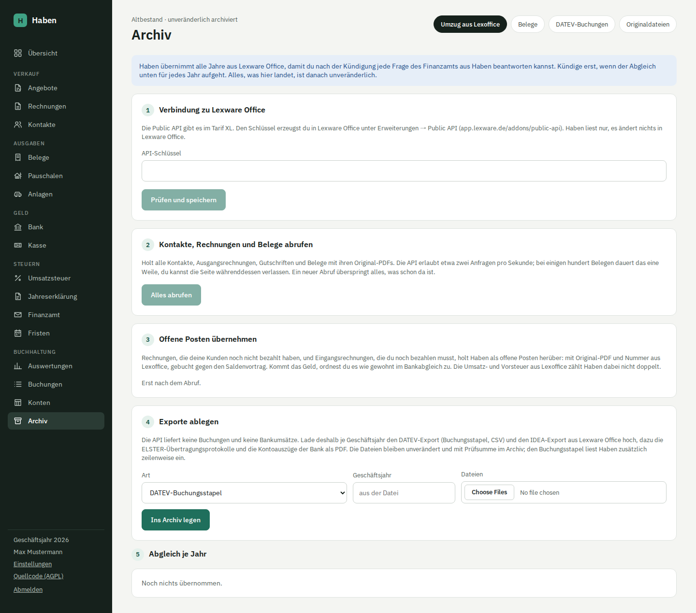

# Umzug aus Lexoffice / Lexware Office

Haben übernimmt deinen Bestand aus Lexware Office (früher Lexoffice), damit du das Abo kündigen kannst, ohne Daten zu verlieren. Der Umzug läuft auf der Seite **Archiv** unter „Umzug aus Lexoffice“ in fünf Schritten.

## Worum es geht

Nach der Kündigung kommst du nicht mehr an deine Rechnungen, Belege und Buchungen in Lexware Office. Das Finanzamt kann aber noch Jahre später danach fragen. Haben holt deshalb alles, was die Schnittstelle hergibt, legt die Exporte unverändert daneben und zeigt dir je Geschäftsjahr, ob etwas fehlt. Was einmal im Archiv ist, lässt sich nicht mehr ändern oder löschen.

Der Altbestand bleibt von deiner laufenden Buchhaltung getrennt: Er fließt nicht in Bankabgleich, Voranmeldung und Auswertungen von Haben ein. Die einzige Ausnahme sind offene Posten, die du in Schritt 3 ausdrücklich übernimmst.

> [!NOTE]
> Der Abruf über die API ist gegen die öffentliche Dokumentation von Lexware Office gebaut und mit nachgestellten Antworten getestet. Ein Lauf gegen ein echtes Konto steht noch aus. Rechne damit, dass beim ersten echten Abruf Fehler auftauchen können, und kündige erst, wenn der Abgleich für jedes Jahr aufgeht.

## Voraussetzungen

- Die Public API von Lexware Office gibt es nur im **Tarif XL**. Hast du einen kleineren Tarif, reicht es in der Regel, für einen Monat auf XL zu wechseln, den Abruf zu machen und danach zu kündigen.
- Den API-Schlüssel erzeugst du in Lexware Office unter **Erweiterungen → Public API** (`app.lexware.de/addons/public-api`).
- In Haben sollten Firmendaten, Kontenrahmen und Versteuerungsart (Ist oder Soll) eingerichtet sein ([Einrichtung](einrichtung.md)). Die Versteuerungsart bestimmt, wie offene Posten gebucht und wie die Umsatzsteuer im Abgleich gerechnet wird. Sie sollte dieselbe sein wie in Lexware Office.
- Der Server braucht Zugriff auf `https://api.lexware.io`.

## Schritt 1: Verbindung zu Lexware Office

Füge den API-Schlüssel ein und klicke „Prüfen und speichern“. Haben fragt damit das Profil ab; klappt das, steht der Firmenname aus Lexware Office da. Der Schlüssel wird mit AES-256-GCM verschlüsselt in der Datenbank gespeichert (mit `HABEN_ENCRYPTION_KEY`, wie das ELSTER-Zertifikat) und taucht weder im Änderungsprotokoll noch im Jahresexport auf.

Haben liest nur. Es legt in Lexware Office nichts an und ändert nichts. Nach dem Umzug kannst du den Schlüssel mit „Schlüssel entfernen“ löschen und ihn in Lexware Office widerrufen.

## Schritt 2: Kontakte, Rechnungen und Belege abrufen

„Alles abrufen“ startet den Abruf im Hintergrund. Du kannst die Seite verlassen; der Fortschritt aktualisiert sich alle zwei Sekunden. Der Abruf läuft in drei Phasen:

1. **Kontakte:** alle Kontakte mit Name, Kundennummer, Rechnungsadresse (sonst Lieferadresse), erster E-Mail-Adresse und USt-IdNr. Archivierte Kontakte werden in Haben archiviert angelegt.
2. **Belegliste:** alle Ausgangsrechnungen, Gutschriften und Abschlagsrechnungen aus dem Rechnungsmodul sowie alle Einnahme- und Ausgabebelege samt Gutschriften aus der Buchhaltung, archiviert und nicht archiviert. Entwürfe bleiben draußen.
3. **Belege und Dateien:** je Beleg die Details, der Zahlungsstatus mit den einzelnen Zahlungen, das Original-PDF, bei E-Rechnungen das XML und bei Buchhaltungsbelegen alle angehängten Dateien. Die Kategorien aus Lexware Office kommen mit ihrem Namen dazu.

Die Antwort der API wird je Beleg vollständig gespeichert, zum Nachweis. Beträge rechnet Haben in Cent um; maßgeblich sind Brutto und Steuer des Belegs, Netto ergibt sich daraus. Bei Schlussrechnungen steht der volle Rechnungsbetrag drin, nicht der nach Abzug der Abschläge geforderte Rest.

### Kontakte verknüpfen

Gibt es in Haben schon einen Kontakt mit demselben Namen (Groß- und Kleinschreibung egal) und ohne Lexoffice-Herkunft, verknüpft Haben ihn statt einen zweiten anzulegen. Der Fortschritt zeigt das unter „verknüpft“. Kontakte, die schon aus einem früheren Abruf stammen, überspringt Haben.

### Rate-Limit, Abbruch und Fortsetzen

Die API erlaubt etwa zwei Anfragen pro Sekunde. Haben hält zwischen zwei Anfragen mindestens 600 ms Abstand und wiederholt bei Rate-Limit (429) oder Serverfehlern (502, 503, 504) und Netzwerkfehlern bis zu fünfmal, mit wachsender Wartezeit bzw. so lange, wie die API mit `Retry-After` verlangt. Bei einigen hundert Belegen dauert der Abruf deshalb eine Weile.

- **Abbrechen** beendet den Lauf. Ein neuer Abruf überspringt alles, was schon da ist, und setzt dort fort.
- Wird der Server während des Abrufs neu gestartet, markiert Haben den Lauf nach drei Minuten ohne Fortschritt als abgebrochen. Auch dann setzt „Erneut abrufen“ fort.
- Ist der Schlüssel ungültig oder fehlt die Berechtigung (Tarif gewechselt), bricht der Lauf mit Fehlermeldung ab.
- Schlägt ein einzelner Beleg fehl, läuft der Abruf weiter. Die fehlgeschlagenen Belege stehen mit Nummer und Fehlermeldung in einer aufklappbaren Liste; der nächste Abruf versucht sie erneut.

Der Schritt ist erledigt, wenn ein Lauf fertig ist und die Liste der fehlgeschlagenen Belege leer ist.

### Was die API nicht liefert

- **Keine Buchungen.** Kontierung, Umbuchungen und Kontensalden gibt es nur im DATEV-Export (Schritt 4).
- **Keine Bankumsätze.** Die Kontoauszüge holst du bei deiner Bank.
- **Keine übermittelten Voranmeldungen** und keine ELSTER-Protokolle.
- Angebote, Auftragsbestätigungen, Lieferscheine und Mahnungen ruft Haben nicht ab.

## Schritt 3: Offene Posten übernehmen

Rechnungen, die deine Kunden noch nicht bezahlt haben, und Eingangsrechnungen, die du noch zahlen musst, sollen nach dem Umzug in Haben bezahlt werden. Dieser Schritt listet sie auf, sobald der Abruf gelaufen ist. Mit „Übernehmen“ (oder „Alle … übernehmen“) holst du sie herüber:

- Eine offene **Ausgangsrechnung** wird zu einer festgeschriebenen Rechnung in Haben, mit dem Original-PDF und der Rechnungsnummer aus Lexware Office (ohne Nummer `LX-` plus Kurz-ID). Je Steuersatz entsteht eine Position. Der Kunde ist der verknüpfte Kontakt; fehlt er, legt Haben ihn aus der Rechnungsadresse an.
- Ein offener **Ausgabebeleg** wird zu einem gebuchten Beleg mit Zahlung „Bank“, mit Datei, Lieferant, Nummer, Belegdatum, Fälligkeit und Beträgen je Steuersatz. Die Kategorie leitet Haben grob aus den Kategorienamen in Lexware Office ab; sie zählt nur für die Aufteilung in der EÜR.

Danach ordnest du den Zahlungseingang bzw. die Zahlung wie gewohnt im [Bankabgleich](bank.md) zu.

### Wie gebucht wird

Die Erlöse und Aufwände stehen schon in den Büchern von Lexware Office. Haben bucht deshalb nicht noch einmal Erlös oder Aufwand, sondern gegen den Saldenvortrag (Konto 9000), mit dem Datum der Übernahme. Die genauen Buchungssätze stehen in [Buchhaltung in Haben](buchhaltung.md#eröffnungsbuchungen-für-offene-posten-aus-lexoffice).

| Fall | Buchung | Umsatz- bzw. Vorsteuer |
| --- | --- | --- |
| Rechnung, Ist-Versteuerung | Forderung an Umsatzsteuer nicht fällig und Saldenvortrag | Noch nicht angemeldet; wird mit dem Zahlungseingang in Haben fällig und landet in der Voranmeldung des Zahlungsmonats |
| Rechnung, Soll-Versteuerung | Forderung an Saldenvortrag | Schon in Lexware Office angemeldet; Haben zählt sie nicht noch einmal |
| Eingangsbeleg | Saldenvortrag an Verbindlichkeiten | Vorsteuer schon in Lexware Office angemeldet; Haben zählt sie nicht noch einmal |

So wird keine Steuer doppelt angemeldet. In der EÜR von Haben zählt die Zahlung, wenn sie in Haben eingeht oder abfließt, wie jede andere Zahlung.

### Was nicht übernommen wird

Übernehmen lassen sich nur Rechnungen aus dem Rechnungsmodul und Ausgabebelege, die laut Lexware Office offen sind. Statt des Knopfs steht der Grund da, wenn einer dieser Punkte zutrifft:

| Hinweis | Was du tun kannst |
| --- | --- |
| Fremdwährung | Von Hand in Haben erfassen |
| teilweise bezahlt | Den Rest in Lexware Office ausgleichen oder die Zahlung in Haben ohne Rechnung buchen |
| Steuersatz, den Haben nicht kennt | Haben kennt 19 %, 7 % und 0 % |
| Betrag nicht positiv | Gutschriften werden nicht übernommen |
| keine Datei aus Lexoffice | Erst die Datei in Lexware Office anhängen und erneut abrufen |

Außerdem lehnt Haben die Übernahme ab, wenn die Rechnungsnummer in Haben schon vergeben ist, wenn sich die Steuer aus den Positionen nicht centgenau nachbilden lässt oder wenn die Datei eines Belegs schon als Beleg in Haben liegt (dann bezahlst du dort).

## Schritt 4: Exporte ablegen

Was die API nicht liefert, lädst du als Datei hoch. Wähle die Art, das Geschäftsjahr (beim DATEV-Stapel optional) und eine oder mehrere Dateien (bis zu 50 auf einmal, je höchstens 100 MB):

| Art | Woher | Was Haben damit macht |
| --- | --- | --- |
| DATEV-Buchungsstapel | Lexware Office, DATEV-Export, je Geschäftsjahr die CSV mit den Buchungen | Ablegen und zeilenweise einlesen |
| IDEA-Export | Lexware Office, Export für die Betriebsprüfung | Ablegen |
| ELSTER-Protokoll | Übertragungsprotokolle der Voranmeldungen | Ablegen |
| Kontoauszug | Bank, als PDF | Ablegen |
| Sonstiges | alles andere, was du aufheben willst | Ablegen |

Jede Datei bleibt byte-genau erhalten und liegt unter ihrem SHA-256. Dieselbe Datei zweimal hochzuladen lehnt Haben ab.

> [!IMPORTANT]
> Bei IDEA-Export, ELSTER-Protokollen und Kontoauszügen ist das **Geschäftsjahr** Pflicht; danach richten sich Abgleich und Jahresexport.

### DATEV-Buchungsstapel

Haben erkennt einen Buchungsstapel am Inhalt, auch wenn du eine andere Art gewählt hast. Erwartet wird das DATEV-Format EXTF (oder DTVF), Formatkategorie 21 „Buchungsstapel“, Version 7xx. Andere DATEV-Exporte, etwa Kontenbeschriftungen oder Debitoren/Kreditoren, werden mit Namen abgelehnt.

- **Kodierung:** UTF-8 (mit oder ohne BOM), UTF-16 mit BOM; alles andere liest Haben als Windows-1252.
- **Spalten:** Haben sucht die Spalten über ihren Namen, nicht ihre Position. Pflicht sind Umsatz, Soll/Haben-Kennzeichen, Konto, Gegenkonto und Belegdatum. Übernommen werden außerdem Währung, BU-Schlüssel, Belegfeld 1 und 2, Buchungstext und Beleglink; alle anderen nicht leeren Spalten bleiben je Zeile unverändert gespeichert.
- **Belegdatum:** DATEV schreibt meist nur Tag und Monat (`TTMM`). Das Jahr ergibt sich aus dem Wirtschaftsjahresbeginn in der Kopfzeile; Monate vor dem Beginnmonat gehören ins Folgejahr. Liegt das Datum außerhalb des Zeitraums aus der Kopfzeile, nimmt Haben das andere Kalenderjahr des Zeitraums, sonst gibt es eine Warnung. `TTMMJJJJ` wird direkt gelesen.
- **Geschäftsjahr:** Lässt du das Feld leer, nimmt Haben das Jahr des Wirtschaftsjahresbeginns.
- **Fehler:** Negative Umsätze, ein Soll/Haben-Kennzeichen außer S oder H, fehlende Konten oder ein unmögliches Datum führen zur Ablehnung der ganzen Datei mit Zeilennummer. Hinweise wie „Umsatz ist 0,00“ werden angezeigt, die Datei wird trotzdem übernommen.
- **Überschneidung:** Ein Zeitraum darf nur einmal übernommen werden. Liegt eine schon eingelesene Buchung zwischen dem ersten und dem letzten Datum des neuen Stapels, lehnt Haben die Datei ab und nennt die vorhandene.

Unter **DATEV-Buchungen** siehst du die Zeilen je Jahr, durchsuchbar nach Text, Belegfeld und Konto, und darunter die Umsätze je Konto. Dort, wo eine Steuerautomatik greift, sind die Beträge brutto; die Steuer ist nicht auf ein Steuerkonto aufgeteilt.

## Schritt 5: Abgleich je Jahr

Für jedes Geschäftsjahr, aus dem Belege, Buchungen oder Dateien vorliegen, zeigt Haben eine Karte mit Prüfungen. Ein Jahr ist „vollständig“, wenn alle erfüllt sind:

| Prüfung | Erfüllt, wenn |
| --- | --- |
| Belege und Rechnungen per API abgerufen | mindestens ein Beleg mit Datum in diesem Jahr vorliegt |
| Jeder Beleg hat eine Datei | kein Beleg des Jahres ohne Datei ist; „Belege ohne Datei ansehen“ zeigt die Liste |
| DATEV-Buchungsstapel übernommen | Buchungen mit Datum in diesem Jahr eingelesen sind |
| Jede Buchung mit Belegnummer findet ihren Beleg | für jede Buchung mit Belegfeld 1 ein Lexoffice-Beleg mit derselben Nummer existiert (Leerzeichen und Groß-/Kleinschreibung egal); Buchungen ohne Belegnummer, etwa Umbuchungen, werden nur gezählt |
| IDEA-Export archiviert | eine Datei der Art IDEA mit diesem Jahr vorliegt |
| ELSTER-Protokolle archiviert | mindestens ein ELSTER-Protokoll mit diesem Jahr vorliegt |
| Kontoauszüge archiviert | mindestens ein Kontoauszug mit diesem Jahr vorliegt |

Daneben stehen Einnahmen netto, Umsatzsteuer, Ausgaben netto und Vorsteuer, jeweils nach Belegdatum, und die letzte Rechnungsnummer des Jahres. Vergleiche die Summen mit den Auswertungen in Lexware Office.

### Umsatzsteuer je Monat

Aufgeklappt zeigt jede Karte eine Tabelle je Monat, berechnet aus den abgerufenen Belegen:

| Spalte | Inhalt |
| --- | --- |
| Kz 81 | Bemessungsgrundlage (netto) der Umsätze zu 19 % |
| Kz 86 | Bemessungsgrundlage (netto) der Umsätze zu 7 % |
| Kz 66 | Vorsteuer aus Ausgabebelegen nach Belegdatum |
| Andere Sätze | Umsätze zu 0 % und Altsätzen (16 %, 5 %), nur zur Information |

Bei Soll-Versteuerung zählen Einnahmen nach Belegdatum. Bei Ist-Versteuerung zählen sie anteilig nach Datum der einzelnen Zahlungen aus dem Zahlungsstatus; Skonto, Mahnkosten, Kursdifferenzen und Forderungsausfälle zählen dabei nicht. Gutschriften mindern die Umsätze.

Lege die übermittelten Voranmeldungen (ELSTER-Protokolle) daneben und vergleiche Monat für Monat. Bemessungsgrundlagen meldet ELSTER in vollen Euro, kleine Abweichungen im Centbereich sind also normal. Größere Abweichungen entstehen, wenn in Lexware Office nachträglich etwas korrigiert, eine Voranmeldung von Hand angepasst oder eine Rechnung storniert wurde. Kläre sie vor der Kündigung.

### Rechnungsnummern weiterzählen

Im laufenden Jahr erinnert die Karte daran, die nächste Rechnungsnummer in den [Einstellungen](einrichtung.md) auf die Nummer nach der letzten aus Lexware Office zu setzen, damit der Nummernkreis lückenlos weiterläuft.

## Unveränderlich archiviert

Abgerufene Belege, ihre Dateien, archivierte Exporte und DATEV-Buchungen kann niemand mehr ändern oder löschen, auch nicht direkt in der Datenbank: Postgres-Trigger lehnen `UPDATE` und `DELETE` ab. Das Ablegen jeder Datei und jeder Abruf stehen im Änderungsprotokoll. Ändern dürfen sich nur der gespeicherte Schlüssel und der Fortschritt eines laufenden Abrufs.

Unter **Belege** findest du den Altbestand je Jahr, filterbar nach Einnahmen und Ausgaben, nach Nummer, Kontakt oder Notiz durchsuchbar und mit dem Filter „ohne Datei“. Jeder Beleg zeigt die Beträge je Steuersatz, die Kategorien, den Zahlungsstatus und seine Dateien. Unter **Originaldateien** liegen die hochgeladenen Exporte zum Herunterladen.

Im [Jahresexport](auswertungen.md#jahresexport) steht der Altbestand jedes Jahres unter `lexoffice/`: Belege mit Originaldateien, `belege.csv`, `datev-buchungen.csv` und die Originalexporte unter `originale/`.

## Andere API-Adresse

Haben spricht standardmäßig mit `https://api.lexware.io/v1`. Mit der Umgebungsvariable `LEXOFFICE_API_URL` setzt du eine andere Basis-URL, etwa zum Testen gegen einen nachgestellten Server oder falls Lexware die Adresse ändert. Die ältere Adresse `https://api.lexoffice.io/v1` sollte ebenfalls funktionieren.

## Grenzen

- Der Client ist noch nicht gegen ein echtes Lexware-Konto gelaufen (siehe Hinweis oben).
- Buchungen kommen nur aus dem DATEV-Stapel und werden archiviert, nicht in das Journal von Haben übernommen. Kontensalden und Saldenvorträge musst du für den Jahreswechsel selbst bzw. mit deiner Steuerberatung festhalten.
- Der Abgleich prüft Vollständigkeit und Nummern, keine Kontierung. Summen und Umsatzsteuer vergleichst du selbst mit Lexware Office.
- Teilweise bezahlte Posten, Gutschriften, Fremdwährung und andere Steuersätze als 19, 7 und 0 % werden nicht als offene Posten übernommen.
- Abschlagsrechnungen und die zugehörige Schlussrechnung stehen beide mit ihrem vollen Betrag im Altbestand; in den Summen nach Belegdatum kann ein Betrag deshalb doppelt erscheinen.
- Bei ungeprüften Belegen ohne Belegdatum nimmt Haben das Anlagedatum; solche Belege haben oft keine Beträge.

## Vor der Kündigung

- [ ] Abruf ist fertig, die Liste der fehlgeschlagenen Belege ist leer
- [ ] Für jedes Geschäftsjahr: DATEV-Buchungsstapel, IDEA-Export, ELSTER-Protokolle und Kontoauszüge abgelegt, jeweils mit Jahr
- [ ] Jedes Jahr zeigt „vollständig“
- [ ] Einnahmen, Ausgaben, Umsatz- und Vorsteuer je Jahr mit Lexware Office verglichen
- [ ] Umsatzsteuer je Monat mit den übermittelten Voranmeldungen verglichen
- [ ] Offene Posten übernommen oder die Gründe geklärt
- [ ] Nächste Rechnungsnummer in Haben gesetzt
- [ ] Jahresexport für jedes übernommene Jahr heruntergeladen und die Prüfsummen geprüft
- [ ] Backup von Datenbank und Belegdateien läuft ([Installation](installation.md))
- [ ] API-Schlüssel in Haben entfernt und in Lexware Office widerrufen

> [!NOTE]
> Stimme den Umzug mit deiner Steuerberatung ab, besonders die Saldenvorträge zum Jahreswechsel und die Frage, welche Unterlagen du in welcher Form aufbewahren musst.
