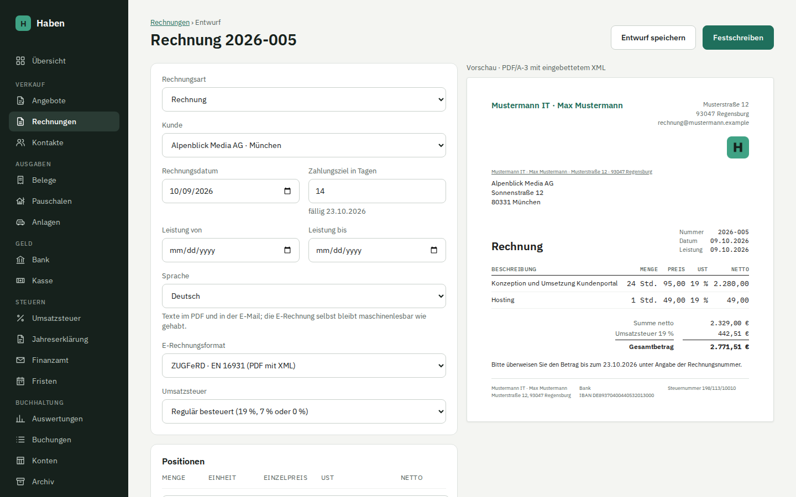

# Rechnungen und E-Rechnung

Haben schreibt Ausgangsrechnungen als E-Rechnung: ZUGFeRD (PDF/A-3 mit eingebettetem XML, Profil EN 16931) oder XRechnung 3.0 in CII- oder UBL-Syntax. Eine Rechnung ist zuerst ein Entwurf, den du beliebig ändern kannst. Mit dem Festschreiben bekommt sie ihre Nummer, PDF und XML werden erzeugt, sie wird gebucht und ist danach unveränderlich.

## Voraussetzungen

Bevor du die erste Rechnung festschreibst, brauchst du:

- **Firmendaten** unter Einstellungen: Firmenname, Anschrift, E-Mail-Adresse, IBAN und Steuernummer oder USt-IdNr. Fehlt etwas, zeigt der Editor oben „Vor dem Festschreiben: …“ mit einem Link „Firmendaten ergänzen“. Siehe [einrichtung.md](einrichtung.md).
- **Einen Kontakt** für den Kunden (siehe [Kontakte](#kontakte)).
- Für XRechnung zusätzlich eine **Telefonnummer** in den Firmendaten und beim Kunden eine **E-Mail-Adresse oder Leitweg-ID**.

## So gehst du vor

1. Unter **Rechnungen** auf **Neue Rechnung** klicken.
2. **Kunde** wählen. Hat der Kontakt ein Standardformat, wird es übernommen; hat er eine Leitweg-ID und kein Standardformat, stellt Haben auf XRechnung 3.0 (CII) um.
3. **Rechnungsdatum** und **Zahlungsziel in Tagen** (0 bis 120) eintragen. Darunter steht das errechnete Fälligkeitsdatum (siehe [Fälligkeit](#fälligkeit)). Vorgabe für das Zahlungsziel ist der Wert aus den Firmendaten.
4. Optional **Leistung von** und **Leistung bis**. Ohne Angabe gilt das Rechnungsdatum als Leistungsdatum; ist nur ein Tag angegeben oder sind beide gleich, erscheint auf der Rechnung „Leistungsdatum“, sonst „Leistungszeitraum“.
5. **E-Rechnungsformat** prüfen.
6. Unter **Umsatzsteuer** die steuerliche Behandlung wählen, im Normalfall „Regulär besteuert“ (siehe [Umsatzsteuer auf der Rechnung](#umsatzsteuer-auf-der-rechnung)).
7. **Positionen** erfassen: Beschreibung, Menge, Einheit, Einzelpreis und Steuersatz. Mit **+ Position hinzufügen** kommt eine weitere Zeile dazu; sie übernimmt Einheit und Steuersatz der letzten Zeile.
8. Optional einen **Hinweis auf der Rechnung** eintragen (bis 2000 Zeichen).
9. **Entwurf speichern** oder direkt **Festschreiben**. Das Festschreiben fragt einmal nach: erst der zweite Klick auf **Jetzt festschreiben** führt es aus.

Rechts zeigt die Vorschau die Rechnung, während du tippst. Die Überschrift im Editor nennt die Nummer, die die Rechnung voraussichtlich bekommt; vergeben wird sie erst beim Festschreiben.

Einen Entwurf, den du nicht mehr brauchst, entfernst du mit **Entwurf löschen**. Das geht nur, solange er nicht festgeschrieben ist.

### Positionen

| Feld | Werte |
| --- | --- |
| Menge | Bis zu drei Nachkommastellen, z. B. `0,5` oder `152`. Muss größer als null sein. |
| Einheit | `Std.`, `Tag`, `Monat`, `Stk.`, `Psch.`, `km` |
| Einzelpreis | In Euro, z. B. `95,00`. Negative Preise sind möglich, etwa für einen Rabatt. |
| Steuersatz | 19 %, 7 % oder 0 % |

Das Zeilennetto ist Menge mal Einzelpreis, kaufmännisch auf Cent gerundet. Die Umsatzsteuer rechnet Haben nach EN 16931 je Steuersatz auf die Summe der Zeilennetto, nicht als Summe der Steuer je Zeile. Bei mehreren Steuersätzen weist das PDF die Steuer je Satz mit ihrer Bemessungsgrundlage aus.

Die Einheiten gehen mit ihren UN/ECE-Codes ins XML (`HUR`, `DAY`, `MON`, `H87`, `LS`, `KMT`).

### Artikelkatalog

Unter **Rechnungen › Artikel** legst du Positionen an, die du oft brauchst: Stundensatz, Tagessatz, Wartungspauschale.

- Jeder Artikel hat Bezeichnung, optional eine Artikelnummer, Einheit, Nettopreis und Steuersatz, dazu eine interne Notiz.
- Im Editor für Rechnungen und Angebote fügt **Aus dem Katalog einfügen** den Artikel als Position mit Menge 1 ein. Ist die einzige Zeile noch leer, ersetzt er sie.
- Text, Menge und Preis passt du danach in der Position an.
- Ohne Steuerausweis (Kleinunternehmer, Reverse Charge, steuerfrei) setzt Haben den Steuersatz der Position auf 0 %.
- Änderungen am Katalog wirken nur auf neue Positionen. Festgeschriebene Rechnungen bleiben, wie sie sind.
- Nicht mehr gebrauchte Artikel archivierst du; sie lassen sich wiederherstellen. Jede Änderung steht im Änderungsprotokoll.

Wiederkehrende Rechnungen haben ihre Positionen in der Vorlage und nutzen den Katalog nicht.

### Umsatzsteuer auf der Rechnung

Das Feld **Umsatzsteuer** legt fest, wie die Rechnung umsatzsteuerlich behandelt wird. Gespeichert wird die Auswahl an der Rechnung; sie bestimmt Erlöskonto, Kennzahl der [Voranmeldung](umsatzsteuer.md), Steuerkategorie im XML und den Pflichthinweis.

| Auswahl | Wann | Hinweis auf der Rechnung (Standard) | Steuerkategorie im XML |
| --- | --- | --- | --- |
| Regulär besteuert (19 %, 7 % oder 0 %) | Normalfall | – | S, bei 0 % Z |
| Reverse Charge: Leistung an Unternehmen im EU-Ausland | Sonstige Leistung an ein Unternehmen mit USt-IdNr. in einem anderen EU-Land | Steuerschuldnerschaft des Leistungsempfängers (Reverse Charge, Art. 196 MwStSystRL). | AE, Grund `VATEX-EU-AE` |
| Leistung ins Nicht-EU-Ausland | Leistungsort im Drittland, im Inland nicht steuerbar | Im Inland nicht steuerbare Leistung (Leistungsort im Drittland). | O, Grund `VATEX-EU-O` |
| Steuerfrei nach § 4 UStG | Steuerfreie Leistung, etwa nach § 4 Nr. 14 UStG | die Befreiungsvorschrift, die du einträgst | E |
| Kleinunternehmer nach § 19 UStG | Nur wählbar, wenn du in den Einstellungen als Kleinunternehmer eingetragen bist | Gemäß § 19 UStG wird keine Umsatzsteuer berechnet. | E |

Außer bei „Regulär besteuert“ gilt:

- Alle Positionen stehen auf 0 %, der Steuersatz lässt sich nicht ändern. In der Vorschau und im PDF steht in der Spalte für den Steuersatz „–“, und die Zeile „Umsatzsteuer 0 %“ entfällt.
- Der Hinweis steht fett über dem Satz zur Zahlung. Im Feld **Hinweis zur Umsatzsteuer** kannst du einen eigenen Text eintragen, der den Standardtext ersetzt. Bei „Steuerfrei nach § 4 UStG“ heißt das Feld **Befreiungsvorschrift** und ist Pflicht, z. B. „Steuerfrei nach § 4 Nr. 14 UStG“.
- Im XML steht der Hinweis als Befreiungsgrund in der Steueraufschlüsselung.

Bei Reverse Charge erinnert der Editor daran, dass die Leistung zusätzlich in die Zusammenfassende Meldung (ZM) an das Bundeszentralamt für Steuern gehört. Die ZM erstellt Haben nicht. Bei „Leistung ins Nicht-EU-Ausland“ lässt Haben im XML die USt-IdNr. von dir und vom Kunden weg (BR-O-02); als Kennung des Verkäufers dient dann die Steuernummer bzw. USt-IdNr. (BT-29). Den Steuersatz lässt Haben in den Positionen des XML weg; in der Steueraufschlüsselung steht 0, weil XRechnung ihn dort verlangt (BR-DE-14).

Bist du in den Einstellungen als Kleinunternehmer eingetragen, bekommen neue Rechnungen automatisch „Kleinunternehmer nach § 19 UStG“, und die Auswahl ist gesperrt. Siehe [Erste Schritte](einrichtung.md#kleinunternehmer).

### Format wählen

| Auswahl im Editor | Was entsteht |
| --- | --- |
| ZUGFeRD · EN 16931 (PDF mit XML) | PDF/A-3 mit eingebetteter `factur-x.xml` (CII, Profil EN 16931). Das XML steht zusätzlich einzeln zum Download bereit. |
| XRechnung 3.0 (CII) | XRechnung als CII-XML; das PDF ist eine Sichtkopie. |
| XRechnung 3.0 (UBL) | XRechnung als UBL-XML; das PDF ist eine Sichtkopie. |

Die Reihenfolge, nach der Haben das Format vorschlägt: Standardformat des Kontakts, sonst XRechnung (CII) bei vorhandener Leitweg-ID, sonst das Standardformat aus den Einstellungen. Du kannst es im Entwurf jederzeit ändern.

### Was vor dem Festschreiben geprüft wird

Der Editor listet alles auf, was noch fehlt. Geprüft werden:

- Firmendaten: Name, Anschrift, E-Mail-Adresse, IBAN, Steuernummer oder USt-IdNr.
- Kunde gewählt, mindestens eine Position, keine Position mit Betrag 0.
- Umsatzsteuer: Außer bei „Regulär besteuert“ müssen alle Positionen 0 % haben. Reverse Charge braucht deine USt-IdNr. in den Firmendaten und die USt-IdNr. des Kunden, und der Kunde darf nicht in Deutschland sitzen. Bei „Leistung ins Nicht-EU-Ausland“ darf der Kunde nicht in Deutschland sitzen. „Steuerfrei nach § 4 UStG“ braucht die Befreiungsvorschrift.
- Kleinunternehmer: Bist du in den Einstellungen als Kleinunternehmer eingetragen, lässt sich nur eine Kleinunternehmer-Rechnung festschreiben; bist du es nicht, keine.
- Eine Rechnung muss einen positiven Gesamtbetrag haben, eine Rechnungskorrektur einen negativen.
- Formatabhängige Pflichtangaben (aus `validateForFormat` in `packages/einvoice`):

| Angabe | ZUGFeRD | XRechnung |
| --- | --- | --- |
| Name und vollständige Anschrift des Rechnungsstellers | Pflicht | Pflicht |
| E-Mail-Adresse des Rechnungsstellers | Pflicht | Pflicht |
| Steuernummer oder USt-IdNr. | Pflicht | Pflicht |
| Telefonnummer des Rechnungsstellers | – | Pflicht |
| IBAN (bei Rechnungen mit positivem Betrag) | Pflicht | Pflicht |
| Name und vollständige Anschrift des Kunden | Pflicht | Pflicht |
| E-Mail-Adresse oder Leitweg-ID des Kunden | – | Pflicht |
| Bezug zur ursprünglichen Rechnung (Storno, Korrektur) | Pflicht | Pflicht |

## Was beim Festschreiben passiert

Alles läuft in einer einzigen Datenbanktransaktion. Schlägt ein Schritt fehl, bleibt der Entwurf ohne Nummer zurück und im Nummernkreis entsteht keine Lücke.

1. **Nummer ziehen.** Der Zähler je Jahr des Rechnungsdatums wird um eins erhöht. Das Format ist `JJJJ-NNN`, also `2026-034`. Ein Datenbank-Trigger verhindert, dass der Zähler zurückgesetzt wird.
2. **Anschriften einfrieren.** Absender (aus den Firmendaten) und Empfänger (aus dem Kontakt) werden mit der Rechnung gespeichert, dazu die Version des Kontakts. Spätere Änderungen am Kontakt ändern die Rechnung nicht.
3. **PDF erzeugen.** Die sichtbare Rechnung entsteht mit Typst aus einer Vorlage als PDF/A-3b. Als Erstellungszeit steht das Rechnungsdatum im PDF.
4. **XML erzeugen.** Die Bibliothek `@e-invoice-eu/core` erzeugt je nach Format Factur-X EN 16931 (und bettet es ins PDF ein), XRechnung CII oder XRechnung UBL.
5. **Prüfsummen.** Von PDF und XML wird je ein SHA-256 gespeichert. Die ersten Zeichen des PDF-Hashes stehen auf der Detailseite.
6. **Buchen.** Haben legt den Buchungssatz an (siehe unten) und schreibt ihn fest.
7. **Sperren.** Die Rechnung bekommt einen Festschreibungszeitpunkt. Ab dann lehnen Datenbank-Trigger jede Änderung oder Löschung der Rechnung und ihrer Positionen ab.

## Buchungen

Beispiel: Rechnung über 1.000,00 € netto zu 19 %.

**Soll-Versteuerung** (nach vereinbarten Entgelten):

| Konto SKR03 | Konto SKR04 | Soll | Haben |
| --- | --- | ---: | ---: |
| 1400 Forderungen | 1200 Forderungen | 1.190,00 | |
| 8400 Erlöse 19 % | 4400 Erlöse 19 % | | 1.000,00 |
| 1776 Umsatzsteuer 19 % | 3806 Umsatzsteuer 19 % | | 190,00 |

**Ist-Versteuerung** (nach vereinnahmten Entgelten): Die Steuer landet zunächst auf „Umsatzsteuer nicht fällig“ und wird erst mit dem Zahlungseingang fällig (siehe [bank.md](bank.md)).

| Konto SKR03 | Konto SKR04 | Soll | Haben |
| --- | --- | ---: | ---: |
| 1400 Forderungen | 1200 Forderungen | 1.190,00 | |
| 8400 Erlöse 19 % | 4400 Erlöse 19 % | | 1.000,00 |
| 1766 USt nicht fällig 19 % | 3816 USt nicht fällig 19 % | | 190,00 |

Für 7 % gelten die Konten 8300/1771/1761 (SKR03) bzw. 4300/3801/3811 (SKR04), für regulär besteuerte Umsätze zu 0 % das Erlöskonto 8200 bzw. 4200 ohne Steuerzeile. Storno und Rechnungskorrektur haben negative Beträge; dabei tauschen Soll und Haben die Seiten.

Rechnungen ohne Steuerausweis gehen ohne Steuerzeile auf eigene Erlöskonten:

| Umsatzsteuer | Konto SKR03 | Konto SKR04 | Steuerschlüssel |
| --- | --- | --- | --- |
| Reverse Charge | 8336 | 4336 | `RC` (Kz 21) |
| Leistung ins Nicht-EU-Ausland | 8338 | 4338 | `Drittland` (Kz 45) |
| Steuerfrei nach § 4 UStG | 8100 | 4100 | `Steuerfrei` (Kz 48) |
| Kleinunternehmer nach § 19 UStG | 8195 | 4185 | `KU` (keine Kennzahl) |

> [!IMPORTANT]
> Die Kontenzuordnung stammt aus `packages/core/src/posting.ts`. Gleiche sie vor dem Echtbetrieb mit deiner Steuerberatung ab.

## Fälligkeit

Fällig ist eine Rechnung am Rechnungsdatum plus Zahlungsziel. Fällt dieser Tag auf einen Samstag, Sonntag oder gesetzlichen Feiertag im Bundesland aus deinen Firmendaten, gilt der nächste Werktag (§ 193 BGB). Haben kennt nur Feiertage, die im ganzen Bundesland gelten; Feiertage einzelner Gemeinden (Fronleichnam in Teilen Sachsens und Thüringens, Mariä Himmelfahrt in Bayern, Augsburger Friedensfest) zählen nicht. Ohne Bundesland zählen nur die bundesweiten Feiertage. Bei Zahlungsziel 0 ist die Rechnung am Rechnungsdatum fällig, auch an einem Wochenende. Die Berechnung steht in `packages/core/src/holidays.ts`.

## GiroCode

Neben der Zahlungsaufforderung druckt Haben einen GiroCode, also einen EPC-QR-Code nach dem Standard des European Payments Council. Der Kunde scannt ihn mit der Banking-App, und die Überweisung ist ausgefüllt:

- Empfänger, IBAN und BIC aus den Firmendaten,
- der Rechnungsbetrag,
- der Verwendungszweck „Rechnung 2026-001“.

Der Code steht nur auf Rechnungen mit Zahlbetrag und nur, wenn in den Firmendaten eine IBAN steht. Stornorechnungen und Korrekturen bekommen keinen. Mahnungen tragen den Code über den offenen Gesamtbetrag samt Gebühren und Zinsen.

## Abschlags- und Schlussrechnung

Bei größeren Aufträgen rechnest du in Teilen ab: zuerst Abschlagsrechnungen, am Ende eine Schlussrechnung über alles.

1. **Abschlagsrechnung:** Neue Rechnung, unter **Rechnungsart** „Abschlagsrechnung“ wählen und den Teilbetrag als Position eintragen, z. B. „1. Abschlag 30 % gemäß Angebot AN-2026-004“. Sie wird wie jede Rechnung festgeschrieben, gebucht, bezahlt und gemahnt. Im XML trägt sie den Typ 326 (Teilrechnung).
2. **Schlussrechnung:** In der festgeschriebenen Abschlagsrechnung auf **Schlussrechnung erstellen** klicken oder bei einer neuen Rechnung „Schlussrechnung“ wählen. Haben schlägt alle offenen Abschlagsrechnungen des Kunden zum Abzug vor; per Häkchen wählst du sie ab oder wieder an. Unter **Positionen** steht die gesamte Leistung.

Die Abzüge setzt Haben selbst als eigene Positionen darunter, je Abschlagsrechnung und Steuersatz eine, mit Netto und Umsatzsteuer der Abschlagsrechnung, z. B. „Abzüglich Abschlagsrechnung 2026-031 vom 15.09.2026 (netto 3.000,00 €, USt 570,00 €)“. So weist die Schlussrechnung nur noch die Umsatzsteuer auf den Rest aus (§ 14 Abs. 5 UStG), und gebucht wird nur der Restbetrag; die Abschläge sind schon als Erlös gebucht. Im XML verweist die Schlussrechnung auf jede abgezogene Abschlagsrechnung.

Regeln:

- Abziehen lassen sich nur festgeschriebene, nicht stornierte Abschlagsrechnungen desselben Kunden mit derselben Umsatzsteuer-Behandlung, jede nur in einer Schlussrechnung.
- Die Abschläge dürfen die Gesamtleistung nicht übersteigen; ein Restbetrag von 0 € ist erlaubt.
- Eine abgezogene Abschlagsrechnung lässt sich erst stornieren, wenn die Schlussrechnung storniert ist. Danach ist sie wieder frei.

## Rechnungen auf Englisch

Für Kunden im Ausland stellst du im Kontakt **Sprache von Rechnungen und Angeboten** auf Englisch. Neue Rechnungen und Angebote für diesen Kunden übernehmen die Sprache; im Editor lässt sie sich je Beleg unter **Sprache** ändern.

Auf Englisch erscheinen:

- im PDF Titel („Invoice“, „Cancellation invoice“, „Corrective invoice“, „Quote“), Beschriftungen, Einheiten, Datumsangaben („10 Sept 2026“), Beträge („€1,190.00“), Zahlungsaufforderung, Hinweise zur Umsatzsteuer und Fußzeile,
- Betreff und Text der E-Mail; die eigene Vorlage aus den Einstellungen gilt nur für deutsche Rechnungen,
- der Hinweis „As per our quote …“, wenn aus einem englischen Angebot eine Rechnung wird.

Stornorechnung und Rechnungskorrektur übernehmen die Sprache der ursprünglichen Rechnung, wiederkehrende Rechnungen die Sprache des Kontakts. Das XML der E-Rechnung ist sprachunabhängig und bleibt gleich. Mahnungen bleiben deutsch. Ein selbst eingetragener Hinweis zur Steuerbefreiung erscheint so, wie du ihn schreibst.

## Wiederkehrende Rechnungen

Für Monatspauschalen, Wartungsverträge oder Hosting legst du unter **Rechnungen › Wiederkehrend › Neue Vorlage** eine Vorlage an. Haben erzeugt daraus zu jedem Termin eine Rechnung.

| Feld | Bedeutung |
|---|---|
| Intervall | monatlich, vierteljährlich, halbjährlich oder jährlich |
| Nächste Rechnung am | Rechnungsdatum des nächsten Termins. Die folgenden Termine liegen am selben Tag im Monat; der 31. wird in kürzeren Monaten zum Monatsende und springt danach zurück. |
| Endet nach dem | optional. Danach wird die Vorlage inaktiv. |
| Leistungszeitraum | **Laufend:** die Monate ab dem Rechnungsmonat (Vorauszahlung). **Vergangen:** die Monate davor (Abrechnung). **Keiner:** ohne Leistungszeitraum, dann gilt das Rechnungsdatum. |
| Was am Termin passiert | **Entwurf anlegen:** du prüfst und schreibst selbst fest. **Direkt festschreiben:** Nummer, PDF, XML und Buchung wie beim Festschreiben von Hand; auf Wunsch **und per E-Mail an den Kunden schicken** (Vorlage und Adresse wie beim [Versand von Hand](#per-e-mail-versenden)). |
| Kunde, Positionen, Zahlungsziel, Format, Umsatzsteuer, Hinweis | wie im Rechnungseditor |

In Beschreibungen und im Hinweis ersetzt Haben Platzhalter:

| Platzhalter | Beispiel |
|---|---|
| `{monat}` | November |
| `{jahr}` | 2026 |
| `{quartal}` | Q4 |
| `{zeitraum}` | November 2026, bei mehreren Monaten Oktober – Dezember 2026 |

Bezug ist der Leistungszeitraum, ohne Leistungszeitraum das Rechnungsdatum. „Wartung {monat} {jahr}“ wird so zu „Wartung November 2026“. Die Vorschau unter dem Formular zeigt die nächste Rechnung.

**Wann die Rechnungen entstehen:** Der Server prüft kurz nach dem Start und danach stündlich, welche Termine fällig sind. War Haben aus, werden verpasste Termine mit ihrem eigenen Datum nachgeholt. Je Termin entsteht höchstens eine Rechnung, auch bei mehreren gleichzeitigen Läufen. Mit **… fällige jetzt anlegen** in der Liste startest du den Lauf sofort.

Scheitert das Festschreiben, etwa weil in den Firmendaten die IBAN fehlt, bleibt die Rechnung als Entwurf stehen. Scheitert nur der E-Mail-Versand (kein E-Mail-Zugang, keine Adresse beim Kunden, Server nicht erreichbar), ist die Rechnung festgeschrieben und du schickst sie auf ihrer Seite von Hand. Die Vorlage zeigt den Fehler, bis du sie das nächste Mal speicherst.

Die Seite einer Vorlage listet alle daraus erzeugten Rechnungen. Löschen lässt sich eine Vorlage nur, solange daraus keine Rechnung entstanden ist; sonst deaktivierst du sie.

## Mahnwesen

Unter **Rechnungen › Mahnwesen** stehen alle überfälligen Rechnungen: festgeschrieben, nicht storniert, mit offenem Betrag und abgelaufener Fälligkeit. Ob eine Rechnung bezahlt ist, ergibt sich aus den Zuordnungen im [Bankabgleich](bank.md). Je Rechnung siehst du, wie viele Tage sie überfällig ist, den offenen Betrag und die letzte Mahnung mit ihrer Frist.

Der Knopf rechts schlägt die nächste Stufe vor:

| Stufe | Titel auf dem Schreiben |
|---|---|
| Zahlungserinnerung | Zahlungserinnerung |
| 1. Mahnung | Mahnung |
| Letzte Mahnung | Letzte Mahnung, mit Hinweis auf gerichtliche Schritte |

Läuft die Frist der letzten Mahnung noch, ist der Knopf hell. Mahnen kannst du trotzdem.

Im Formular legst du fest:

| Feld | Bedeutung |
|---|---|
| Stufe | Vorschlag ist die nächste; beim Wechsel tauscht Haben Einleitung und Schluss gegen die Vorlage der Stufe |
| Neue Zahlungsfrist | Vorschlag: heute plus die Frist aus den Einstellungen (10 Tage) |
| Mahngebühr | Vorschlag je Stufe aus den Einstellungen |
| Verzugszinsen | Geschäftskunde: Basiszinssatz plus 9 Prozentpunkte, Verbraucher: plus 5 (§ 288 BGB). Taggenau ab dem Tag nach der Fälligkeit bis heute, auf 365 Tage, auf den offenen Betrag. Nur mit Basiszinssatz in den Einstellungen. |
| Verzugspauschale | 40 € nach § 288 Abs. 5 BGB, nur gegenüber Geschäftskunden |
| Einleitung und Schluss | Vorlage je Stufe, frei änderbar |

Rechts siehst du die Forderung mit Gesamtbetrag. **… erstellen** speichert die Mahnung mit PDF und öffnet es. Das PDF hat denselben Briefbogen wie die Rechnung: Rechnungsnummer und -datum, Fälligkeit, offener Betrag, Gebühren und Zinsen, Gesamtbetrag und Zahlungsaufforderung mit IBAN. Mahnungen sind wie verschickte Schreiben unveränderlich (Trigger); eine falsche Mahnung ersetzt du durch eine neue.

Auf der Seite der Rechnung stehen alle Mahnungen mit Link zum PDF, bei überfälligen Rechnungen auch der Knopf für die nächste Stufe.

**Gebühren und Zinsen buchen:** Sie sind keine Rechnung und erhöhen nicht die Forderung. Zahlt der Kunde mehr als die Rechnung, ordnest du im Bankabgleich die Rechnung und den Rest als **Mahngebühren und Verzugszinsen** zu. Gebucht wird Bank an 2650 bzw. 7100 „Sonstige Zinsen und ähnliche Erträge“, ohne Umsatzsteuer (Schadensersatz, kein Entgelt). In der EÜR zählt das als umsatzsteuerfreie Betriebseinnahme.

Jede Mahnung lässt sich auf der Seite der Rechnung **per E-Mail** schicken, mit dem PDF der Mahnung im Anhang (siehe [Per E-Mail versenden](#per-e-mail-versenden)).

## Rechnungsliste und Status

Die Liste unter **Rechnungen** zeigt Nummer, Kunde, Datum, Bruttobetrag und einen Status. Der Status wird bei jedem Aufruf aus den Zuordnungen im Bankabgleich abgeleitet; gespeichert ist nur „Entwurf“ oder „festgeschrieben“.

| Status | Bedeutung |
| --- | --- |
| Entwurf | Noch nicht festgeschrieben, ohne Nummer. |
| Offen | Festgeschrieben, nicht fällig, noch keine Zahlung zugeordnet. |
| Teilbezahlt | Ein Teil ist bezahlt, die Fälligkeit ist noch nicht überschritten. |
| Bezahlt | Der volle Betrag ist im Bankabgleich zugeordnet. |
| Überfällig | Fälligkeit überschritten und noch etwas offen, auch bei Teilzahlung. |
| Storniert | Zu dieser Rechnung gibt es eine festgeschriebene Stornorechnung. |
| Storno | Die Stornorechnung selbst. |
| Korrektur | Eine Rechnungskorrektur. |

## Festgeschriebene Rechnung

Die Detailseite zeigt das PDF, die Eckdaten (Kunde, Rechnungsdatum, Fälligkeit, Netto, Umsatzsteuer, Brutto, Format, Zeitpunkt der Festschreibung, bei Rechnungen ohne Steuerausweis die Umsatzsteuer-Behandlung) und den Anfang des SHA-256 des PDFs.

- **PDF herunterladen** liefert `Rechnung-<Nummer>.pdf`.
- **XML herunterladen** liefert `Rechnung-<Nummer>-cii.xml` bzw. `-ubl.xml`. Bei ZUGFeRD ist das dasselbe XML, das im PDF steckt.

Beide Dateien werden aus der Datenbank ausgeliefert, so wie sie beim Festschreiben entstanden sind. Sie werden nie neu erzeugt.

## Per E-Mail versenden

Mit einem E-Mail-Zugang ([Einstellungen › E-Mail-Versand](einrichtung.md#e-mail)) verschickt Haben festgeschriebene Rechnungen, Stornos, Korrekturen und Mahnungen. Auf der Seite der Rechnung unter **Per E-Mail**:

1. **Rechnung senden** öffnet das Formular. Vorbelegt sind die E-Mail-Adresse des Kunden (aus der Rechnung, sonst aus dem Kontakt), Betreff und Text aus der Vorlage. Alles lässt sich vor dem Senden ändern; mehrere Empfänger trennst du mit Komma (höchstens fünf).
2. **Blindkopie an mich** schickt eine Kopie an den Absender aus den Einstellungen.
3. **Jetzt senden** verschickt die Mail sofort.

| Format | Anhang |
| --- | --- |
| ZUGFeRD | `Rechnung-<Nummer>.pdf` mit eingebettetem XML |
| XRechnung | `Rechnung-<Nummer>.pdf` zur Ansicht und `Rechnung-<Nummer>-cii.xml` bzw. `-ubl.xml` als E-Rechnung |
| Mahnung | das PDF der Mahnung, z. B. `Zahlungserinnerung-<Nummer>.pdf` |

Jeder Versand steht mit Zeitpunkt und Empfänger unter **Per E-Mail**, auch fehlgeschlagene mit der Meldung des Servers. In der Rechnungsliste markiert ✉ per E-Mail versendete Rechnungen. Das Protokoll ist unveränderlich (`mail_log`).

**Vorlagen:** Betreff und Text für Rechnungen und Mahnungen stellst du unter Einstellungen › E-Mail-Versand › Vorlagen ein; leer heißt Standardtext. Platzhalter:

| Platzhalter | Inhalt |
| --- | --- |
| `{art}` | Rechnung, Stornorechnung oder Rechnungskorrektur |
| `{nummer}`, `{datum}` | Rechnungsnummer und -datum |
| `{betrag}` | Bruttobetrag, bei Mahnungen der offene Gesamtbetrag mit Gebühren und Zinsen |
| `{faellig}` | Fälligkeit der Rechnung |
| `{zahlbar}` | „, zahlbar bis zum …“ bei Rechnungen mit Betrag, sonst leer |
| `{kunde}`, `{firma}` | Name des Kunden und deiner Firma |
| `{stufe}`, `{frist}` | nur Mahnungen: Zahlungserinnerung, 1. Mahnung oder Letzte Mahnung und die neue Zahlungsfrist |

Öffentliche Auftraggeber verlangen XRechnungen oft über ihr eigenes Portal (ZRE, OZG-RE oder Peppol) statt per E-Mail; das kann Haben nicht.

## Storno und Rechnungskorrektur

Eine festgeschriebene Rechnung änderst du nicht, du stellst eine neue aus. Auf der Detailseite einer Rechnung gibt es dafür den Abschnitt **Korrigieren**.

| | Stornieren | Rechnungskorrektur anlegen |
| --- | --- | --- |
| Zweck | Hebt die Rechnung vollständig auf. | Mindert den Betrag teilweise. |
| Ergebnis | Stornorechnung mit allen Positionen negativ, sofort festgeschrieben und gebucht. | Entwurf mit allen Positionen negativ, den du anpasst. |
| Bestätigung | Zweiter Klick auf **Jetzt stornieren**. | Festschreiben wie bei einer Rechnung. |
| Bedingung | – | Gesamtbetrag muss negativ bleiben. |

Für beide gilt:

- Sie bekommen eine eigene Nummer aus demselben Nummernkreis und das heutige Datum.
- Sie gehen an die Anschrift, die auf der ursprünglichen Rechnung steht; der Kunde ist im Editor nicht wählbar.
- Sie übernehmen die Umsatzsteuer-Behandlung und den Hinweis der ursprünglichen Rechnung.
- PDF und XML verweisen auf die ursprüngliche Rechnung („zur Rechnung 2026-034 vom …“, im XML als BillingReference).
- Im XML erscheinen sie als Gutschrift (Typcode 381) mit positiven Beträgen; der Zahlungsweg ist offen gelassen, das PDF sagt „Der Betrag wird Ihnen erstattet.“
- Eine bereits stornierte Rechnung lässt sich nicht noch einmal stornieren oder korrigieren. Storno und Korrektur selbst lassen sich nicht weiter korrigieren.
- War die Rechnung schon (teilweise) bezahlt, ist die Stornorechnung im Bankabgleich mit dem gezahlten Betrag offen. Die Rückzahlung an den Kunden ordnest du dort der Stornorechnung zu; bei Ist-Versteuerung mindert sie im Monat der Rückzahlung die Umsatzsteuer.

Die ursprüngliche Rechnung zeigt unter **Korrekturen** alle Stornos und Korrekturen, die sich auf sie beziehen, eine stornierte Rechnung zusätzlich einen roten Hinweis mit Link zur Stornorechnung.

Im Bankabgleich ist eine stornierte Rechnung nicht mehr offen. Eine Rechnungskorrektur erscheint dort als offener Posten mit negativem Betrag, dem du eine Rückzahlung zuordnen kannst.

## Kontakte

Kontakte erreichst du über **Rechnungen** › **Kontakte** oder direkt unter `/kontakte`.

| Feld | Hinweis |
| --- | --- |
| Name oder Firma | Pflicht |
| Kundennummer | Erscheint auf der Rechnung und als Käuferkennung im XML. |
| E-Mail | Für XRechnung: elektronische Adresse des Käufers (BT-49). |
| Straße und Hausnummer, PLZ, Ort | Für das Festschreiben vollständig nötig. |
| Land (ISO-Code) | Zwei Buchstaben, Vorgabe `DE`. Andere Länder erscheinen ausgeschrieben in der Anschrift. |
| USt-IdNr. | Form `DE123456789`, steht dann auf der Rechnung. |
| IBAN | Hilft beim Bankabgleich. Wird beim ersten zugeordneten Zahlungseingang automatisch gemerkt, wenn das Feld leer ist. |
| Leitweg-ID (öffentliche Auftraggeber) | Steht auf der Rechnung und wird im XML als Käuferreferenz verwendet. |
| Standardformat für Rechnungen | ZUGFeRD, XRechnung (CII), XRechnung (UBL) oder „wie in den Einstellungen“. |

**Versionen.** Jede Änderung erhöht die Versionsnummer, der vorige Stand bleibt als Version erhalten. Die Detailseite listet alle Versionen mit Zeitpunkt. Festgeschriebene Rechnungen behalten die Anschrift, die beim Festschreiben galt.

**Archivieren.** Kontakte lassen sich nicht löschen, nur mit **Archivieren** ausblenden und mit **Wiederherstellen** zurückholen. Archivierte Kontakte stehen nicht in der Kundenauswahl des Editors; in der Liste zeigst du sie mit **Archivierte zeigen**.

## Rechnungen aus Lexoffice

Offene Rechnungen, die du bei der Migration aus Lexoffice übernimmst (siehe [lexoffice.md](lexoffice.md)), erscheinen als festgeschriebene Rechnungen mit ihrer Lexoffice-Nummer. Als Format steht dort **Original aus Lexoffice**: Das PDF ist das Original aus Lexoffice, ein XML gibt es nur, wenn Lexoffice eines geliefert hat. Haben bildet je Steuersatz eine Pauschalposition nach, damit Zahlungen im Bankabgleich zugeordnet werden können.

Gebucht werden diese Rechnungen nicht als Erlös, sondern gegen den Saldenvortrag (9000), weil der Erlös schon in den alten Büchern steht. Bei Ist-Versteuerung kommt die noch nicht angemeldete Umsatzsteuer auf „Umsatzsteuer nicht fällig“ und wird mit dem Zahlungseingang fällig. Stornierst oder korrigierst du eine solche Rechnung, bucht Haben ebenfalls gegen den Saldenvortrag statt gegen die Erlöse; bei Soll-Versteuerung mindert das Storno die in Lexoffice angemeldete Umsatzsteuer.

## Prüfung gegen den KoSIT-Validator

Die CI prüft bei jedem Push auf `main` und in jedem Pull Request die erzeugten E-Rechnungen mit dem offiziellen KoSIT-Validator (Version 1.5.0) und der XRechnung-Konfiguration 3.0.2. Geprüft werden Beispielrechnungen in den drei Formaten, darunter einfache Rechnung zu 19 %, gemischte Steuersätze, Storno, Rechnungskorrektur, Leitweg-ID, einzelnes Leistungsdatum, Absender nur mit Steuernummer, eine Rechnung zum Nullsatz sowie je eine Rechnung mit Reverse Charge, ins Drittland, steuerfrei nach § 4 UStG und als Kleinunternehmer. Die Prüfberichte liegen als Artefakt am CI-Lauf. Wie du die Prüfung lokal startest, steht in [entwicklung.md](entwicklung.md).

## Grenzen

- Nur Euro und nur die Steuersätze 19 %, 7 % und 0 %.
- Keine innergemeinschaftlichen Lieferungen von Waren (§ 4 Nr. 1b UStG) und keine Zusammenfassende Meldung; die ZM für Reverse-Charge-Rechnungen gibst du selbst ab.
- Keine Skonto-Angaben, keine Zu- oder Abschläge auf Belegebene.
- Höchstens 200 Positionen je Rechnung.
- Rechnungen gehen per E-Mail über deinen SMTP-Zugang, nicht über Peppol oder die Portale öffentlicher Auftraggeber.
